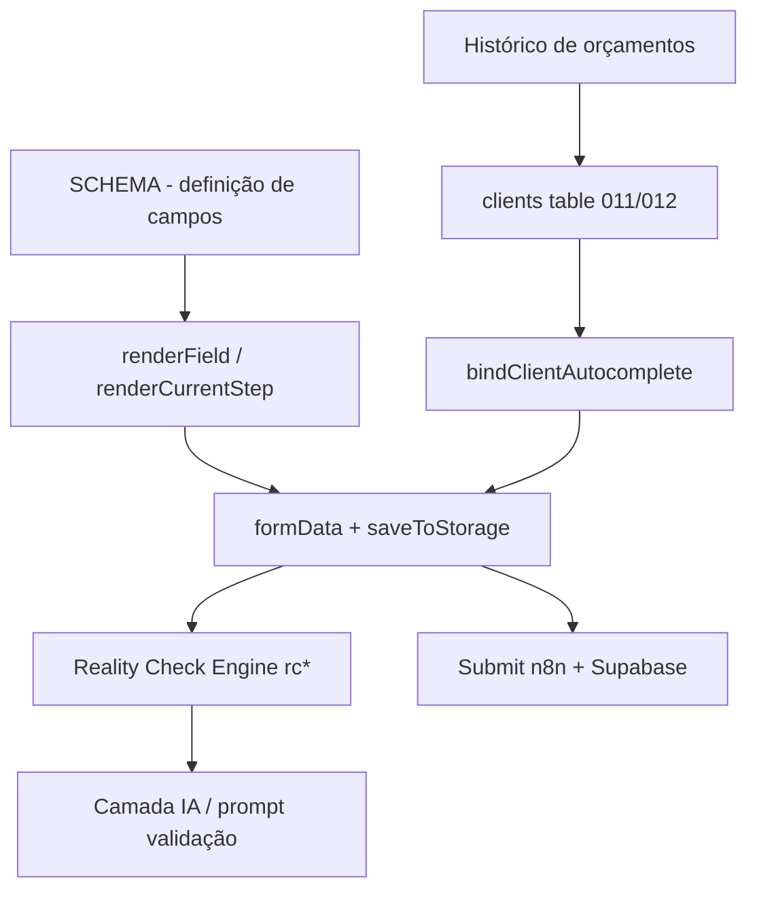

# Wizard V2 — Ajustes pós-UAT — Design

**Spec**: [spec.md](spec.md) · **Context**: [context.md](context.md)
**Status**: Draft

---

## Architecture Overview

Tudo vive no SPA single-file [front.html](../../../front.html). O wizard é dirigido por um objeto
`SCHEMA` (6 steps) renderizado por `renderField()` / `renderCurrentStep()`, com estado em `formData`
persistido em `localStorage` (`saveToStorage`). Validação determinística é o **Reality Check Engine**
(`runRealityCheck` + funções `rc*`), e a camada de IA recebe o resultado como fonte de verdade. A
submissão envia `formData` ao workflow n8n (Wizard Submit). Clientes têm tabela própria
(`migrations/011`, `012`) e autocomplete (`bindClientAutocomplete`).

Os 24 requisitos se agrupam em 5 eixos de mudança:



- **Eixo 1 — SCHEMA puro** (baixo risco): renomeios, limites, opções, faixas. Só editar objetos do `SCHEMA`.
- **Eixo 2 — Componente creatable** (compartilhado, alto impacto): separar busca de valor + destravar.
- **Eixo 3 — Campos condicionais / novos widgets**: transportadora, externa calculada, ICMS, espessura piso por compartimento, chapa xadrez, porta divisória.
- **Eixo 4 — Reality Check / IA**: medida interna×externa, finalidade "Diversos", alerta de terceiros em observações, limites de RT.
- **Eixo 5 — Clientes**: vínculo N→1 e filtro no histórico.

---

## Code Reuse Analysis

### Componentes existentes a alavancar

| Componente                                                 | Local                                                                        | Como usar                                                                             |
| ---------------------------------------------------------- | ---------------------------------------------------------------------------- | ------------------------------------------------------------------------------------- |
| `renderField()` (case `creatable`/`select`)                | [front.html#L6770-L6806](../../../front.html#L6770)                          | Ponto único de render — refatorar o `creatable` aqui                                  |
| `filterOptions()`                                          | [front.html#L7897](../../../front.html#L7897)                                | Mover filtro para input de busca dedicado; nunca esconder opção por valor selecionado |
| handlers creatable (focus/input/mousedown/blur)            | [front.html#L7172-L7205](../../../front.html#L7172)                          | Adaptar para 2 elementos (display + search) e clique no chevron reabrir               |
| `maskCpfCnpj` / `maskCep`                                  | [#L8864](../../../front.html#L8864) / [#L8802](../../../front.html#L8802)    | Padrão para criar `maskPhoneIntl` (DDI+DDD+nº)                                        |
| `local-instalacao-box` (radio + sub-fields condicionais)   | [#L7028-L7090](../../../front.html#L7028)                                    | **Padrão de referência** para os campos condicionais da transportadora                |
| Modal de compartimento (config temp/finalidade/luminárias) | [#L13850-L13970](../../../front.html#L13850)                                 | Acrescentar "espessura isolante piso" por compartimento                               |
| `ACESSORIOS_CAT` (catálogo de porta)                       | [#L14380-L14432](../../../front.html#L14380)                                 | Adicionar chapa xadrez; tornar Resistência+Mola fixas                                 |
| `_perimeterWallsForCompartment`                            | [#L14222](../../../front.html#L14222)                                        | Estender para incluir paredes divisórias                                              |
| `RC_USO_LABELS / _TEMP_RANGES / _STORAGE_DENSITY`          | [#L15445-L15486](../../../front.html#L15445)                                 | Adicionar entrada `diversos` espelhando `outros`                                      |
| `bindClientAutocomplete` + `_client_id`/`_client_locked`   | [#L7625-L7640](../../../front.html#L7625)                                    | Base do vínculo N→1                                                                   |
| `espessura_painel` → dimensão externa                      | [#L12214](../../../front.html#L12214), [#L13308](../../../front.html#L13308) | Reusar para exibir "externa calculada"                                                |

### Pontos de integração

| Sistema                      | Método                                                                                                                                                        |
| ---------------------------- | ------------------------------------------------------------------------------------------------------------------------------------------------------------- |
| Workflow Wizard Submit (n8n) | Novos campos em `formData` viajam no submit — conferir mapeamento em [workflows/São Rafael - Wizard Submit (Save Orçamento).json](../../../workflows/)        |
| Supabase `clients`           | FK `client_id` no orçamento; filtro no histórico via `client_id`                                                                                              |
| Prompt de validação          | [prompts/system_prompt_wizard_validation.md](../../../prompts/system_prompt_wizard_validation.md) — ajustar RT 0–5%, medida interna×externa, alerta terceiros |

---

## Components

### C1 — Creatable v2 (busca separada + destrava) · `CREAT-01`, `FAT-01`(trava)

- **Purpose**: Mostrar sempre todas as opções; busca em campo dedicado; reabrir e trocar seleção.
- **Location**: render [#L6786-L6806](../../../front.html#L6786); handlers [#L7172-L7205](../../../front.html#L7172); `filterOptions` [#L7897](../../../front.html#L7897).
- **Design**:
  - Markup: `creatable-input` (mostra valor escolhido, read-feel) + **campo de busca** dentro do dropdown (`creatable-search`) que filtra apenas a lista. O valor selecionado **nunca** filtra a lista.
  - Chevron passa a ser clicável: toggle do dropdown (`pointer-events:auto`), reabrindo lista completa mesmo com valor preenchido.
  - `filterOptions()` passa a ler de `.creatable-search`, não do input de valor.
  - Ao abrir, limpar busca → todas as opções visíveis.
- **Reuses**: estrutura/CSS atual do creatable (`.creatable-dropdown`, `.creatable-option`).
- **Risco**: componente usado em ~12 campos — regressão. Mitigar testando origem_contato, prazo_pagamento, exigência_faturamento, comprimento/largura/altura.

### C2 — Máscara de telefone internacional · `MASK-01`

- **Purpose**: `+DD (DD) DDDDD-DDDD`, default `+55`, DDI editável.
- **Location**: novo `maskPhoneIntl()` perto de `maskCep`; binding no `contato_telefone` ([#L3592](../../../front.html#L3592)) e no telefone da transportadora (C3).
- **Interfaces**: `maskPhoneIntl(value: string): string`.
- **Reuses**: padrão de `maskCpfCnpj` (cursor-aware) e binding de cnpj_cpf ([#L7888-L7905](../../../front.html#L7888)).

### C3 — Campos condicionais da Transportadora Indicada · `FRETE-01`

- **Purpose**: Ao escolher "Transportadora indicada" em `tipo_frete`, revelar Nome/Telefone/E-mail (não obrigatórios).
- **Location**: step5 ([#L3973](../../../front.html#L3973)); render condicional logo após o select de frete.
- **Design**: replicar o padrão do `local-instalacao-box` (container que mostra/esconde sub-fields conforme valor). Telefone usa C2.
- **Data**: `formData.step5.transportadora_nome/_telefone/_email`.

### C4 — Externa calculada (medida interna→externa) · `DIM-03`

- **Purpose**: Coletar interna; exibir externa = interna + 2×(espessura/1000) por eixo, ao lado do campo.
- **Location**: hints dos campos `comprimento/largura/altura` (step3, [#L3700-L3782](../../../front.html#L3700)).
- **Design**: badge/hint informativo recalculado quando dimensão ou `espessura_painel` muda (já há listener que re-renderiza step3 em mudança de dimensão, [#L7155-L7170](../../../front.html#L7155)). Só informativo — não vira campo.
- **RC**: `rcValidate*` **não** emite erro pela diferença interna/externa (context.md).

### C5 — Modal de compartimento: espessura do isolante de piso · `PISO-01`

- **Purpose**: Campo por compartimento para espessura do isolante de piso.
- **Location**: modal de config ([#L13850-L13970](../../../front.html#L13850)); persiste em `rcGetCompartmentsConfig()` (`cfg[compName].espessura_piso`).
- **Reuses**: mesma mecânica de `qtd_luminarias`/`temperatura_setpoint` por compartimento.

### C6 — Acessórios: chapa xadrez + Resistência/Mola fixas · `ACC-01/02/03`

- **Purpose**: (a) chapa xadrez na porta; (b) chapa xadrez nas laterais da câmara; (c) Resistência no Batente + Mola Aérea sempre incluídas.
- **Location**: `ACESSORIOS_CAT` ([#L14380](../../../front.html#L14380)); acessórios estáticos step4 ([#L3850-L3920](../../../front.html#L3850)).
- **Design**:
  - Adicionar item `Chapa Xadrez (Piso da Porta)` ao `ACESSORIOS_CAT` (grupo "Logística"/"Piso").
  - Adicionar campo step4 `chapa_xadrez_laterais` (select Sim/Não ou multiselect de paredes).
  - Resistência no Batente e Mola Aérea: marcar como `fixed: true` no catálogo → renderizadas como **incluídas e não desmarcáveis** (checkbox travado/marcado), permanecendo no payload.

### C7 — Porta em parede divisória · `PORTA-01`

- **Purpose**: Permitir porta numa parede divisória (interna) entre dois compartimentos.
- **Location**: `_perimeterWallsForCompartment` ([#L14222](../../../front.html#L14222)) e seletor de parede do modal de porta ([#L14689-L15225](../../../front.html#L14689)).
- **Design** (agent's discretion, ver context.md): estender a lista de paredes elegíveis para incluir segmentos divisórios; marcar a porta resultante como `interna: true`; visualizador desenha como interna; carga térmica externa não soma essa folga. Anti-condensação oferecida conforme ΔT entre os dois compartimentos.
- **Risco**: lógica geométrica sensível — isolar numa função auxiliar `_divisorWallsForCompartment` e somar às perimetrais, sem reescrever a existente.

### C8 — Clientes: vínculo N→1 + filtro no histórico · `CLI-01`, `CAD-02`

- **Purpose**: Vincular vários orçamentos a 1 cliente (existente ou novo) e filtrar o histórico por cliente.
- **Location**: autocomplete step2 ([#L7625](../../../front.html#L7625)); tela de histórico (localizar render do histórico); migrations 011/012.
- **Design**:
  - Persistir `formData._client_id` no submit (FK no orçamento). Botão "Vincular a cliente" abre seletor com busca (existente) **ou** "criar novo".
  - Histórico: dropdown "Filtrar por cliente" que consulta orçamentos por `client_id`.
  - `CAD-02`: novos campos step2 `nome_fantasia` (text) e `contribuinte_icms` (select Sim/Não).
- **Dependências**: confirmar coluna `client_id` no schema de orçamentos (migrations) — se faltar, criar migration.

### C9 — SCHEMA edits (eixo baixo risco) · `LBL-*`, `MENU-01`, `RT-01`, `CAD-01`, `DIM-01/02`, `FAT-01`, `PAG-01`

- **Purpose**: Renomeios, limites e opções — edição direta do `SCHEMA`.
- **Mapa**:
  - `RT-01`: `comissao_representante` → label "RT de indicação (%)", `max:5`; `comissao_vendedor` → "RT dificuldade (%)", `max:5`. Atualizar prompt validação ([linha 357-358](../../../prompts/system_prompt_wizard_validation.md)).
  - `CAD-01`: `required:false` em razao_social, cnpj_cpf, cep, endereco_entrega, endereco_numero.
  - `LBL-01`: `altura` label "Altura interna (m)".
  - `LBL-02`: opção "Sem Piso (sobre piso existente)" → "Piso Alvenaria".
  - `LBL-03`: `dados_tecnicos_resumo` label "Ramo de Atividade".
  - `LBL-04`: pergunta do `local-instalacao-box` → "O local de instalação é o mesmo do endereço acima?" (inverter semântica do radio Sim/Não no render [#L7028](../../../front.html#L7028)).
  - `MENU-01`: remover "Separado (NF à parte)" de `faturamento_mao_obra`.
  - `FAT-01`: `exigencia_faturamento` label "Aprovação de Faturamento via…", remover "Emissão de Boleto".
  - `DIM-01`: `altura` options de 1.50 a 12.00 passo 0.005.
  - `DIM-02`: `largura` já passo 0.28 — validar e ajustar mín se preciso.
  - `PAG-01`: `prazo_pagamento` alinhar à tabela RAG + "Outros (especificar)".

### C10 — Finalidade "Diversos" · `FIN-01`

- **Location**: `RC_USO_*` ([#L15445](../../../front.html#L15445)); select finalidade modal ([#L13881](../../../front.html#L13881)).
- **Design**: adicionar `diversos` espelhando `outros` (faixa -40..15, densidade 250, sem crítica de incompatibilidade) e opção no select.

### C11 — Alerta do Agente em observações · `OBS-01`

- **Purpose**: Observação pedindo cotação/terceiros dispara alerta como na Etapa 1.
- **Local**: `observacoes_comerciais` ([#L3534](../../../front.html#L3534)) e `observacoes_instalacao` ([#L3997](../../../front.html#L3997)); prompt de validação.
- **Design**: o alerta da Etapa 1 é gerado pela camada IA/validação. Adicionar instrução no [prompt de validação](../../../prompts/system_prompt_wizard_validation.md) para sinalizar (🟡/🔴) quando observações mencionarem cotação de terceiros/uso de plataformas/recursos externos. Opcional: detector local de palavras-chave (cotar, terceiro, plataforma, locar/alugar) que injeta issue no Reality Check, para feedback imediato sem depender da IA.

---

## Data Models

```typescript
// Novos campos em formData (persistidos + enviados no submit)
interface Step1Patch {
  /* RT */ comissao_representante: number /*0-5*/;
  comissao_vendedor: number; /*0-5*/
}
interface Step2Patch {
  nome_fantasia?: string;
  contribuinte_icms?: "Sim" | "Não";
  _client_id?: string;
}
interface Step5Patch {
  transportadora_nome?: string;
  transportadora_telefone?: string;
  transportadora_email?: string;
  chapa_xadrez_laterais?: string;
}
interface CompartmentConfigPatch {
  espessura_piso?: string; /* mm */
}
interface PortaPatch {
  interna?: boolean;
}
```

**Relationships**: `orcamento.client_id → clients.id` (1 cliente : N orçamentos). Confirmar/crear coluna em migration.

---

## Error Handling Strategy

| Cenário                             | Tratamento                               | Impacto p/ usuário           |
| ----------------------------------- | ---------------------------------------- | ---------------------------- |
| Telefone DDI ≠ 55 incompleto        | borda de erro no blur, não bloqueia      | vê aviso visual              |
| Altura fora de 1,50–12              | `modular005` + faixa → erro de validação | bloqueia avanço com sugestão |
| "Outros" pagamento sem especificar  | exigir campo livre                       | mensagem inline              |
| Compartimento único (sem divisória) | esconder opção de porta divisória        | nada incomum                 |
| Orçamento antigo comissão > 5%      | exibir sem quebrar; limite só na edição  | sem erro                     |
| `client_id` ausente no schema       | criar migration antes do filtro          | —                            |

---

## Tech Decisions (não óbvias)

| Decisão                   | Escolha                                             | Racional                                            |
| ------------------------- | --------------------------------------------------- | --------------------------------------------------- |
| Externa calculada         | hint informativo, não campo                         | evita duplicar fonte de verdade (interna é o input) |
| Resistência/Mola "sempre" | flag `fixed` no catálogo, checkbox travado marcado  | mantém no payload sem o usuário poder remover       |
| Alerta de terceiros       | via prompt de validação (+ detector local opcional) | reaproveita o mesmo mecanismo da Etapa 1            |
| Porta divisória           | função auxiliar separada somada às perimetrais      | não reescreve geometria existente (frágil)          |
| Vínculo de cliente        | FK `client_id` + filtro no histórico                | menor mudança; reusa clients 011/012                |

---

## Open items para Tasks/confirmação

1. **Migration `client_id`**: confirmar se a tabela de orçamentos já tem a coluna; senão, nova migration `013_orcamento_client_link.sql`.
2. **Workflow Submit**: garantir que novos campos (`nome_fantasia`, `contribuinte_icms`, transportadora\_\*, `_client_id`, `espessura_piso` por compartimento) sejam persistidos no n8n/Supabase.
3. **PAG-01**: confirmar com o usuário a lista final de prazos (RAG L48 + "Outros").

---

## Próximo passo

Quebrar em **tasks.md** (escopo Large/Complex). Sugestão de ordenação: C9 (SCHEMA, baixo risco) →
C2/C10 (isolados) → C1 (creatable, testar regressão) → C3/C4/C5/C6 (widgets) → C7 (porta divisória) →
C11 (IA) → C8 (clientes + migration). Itens `[P]` paralelizáveis: C2, C9, C10 são independentes entre si.
