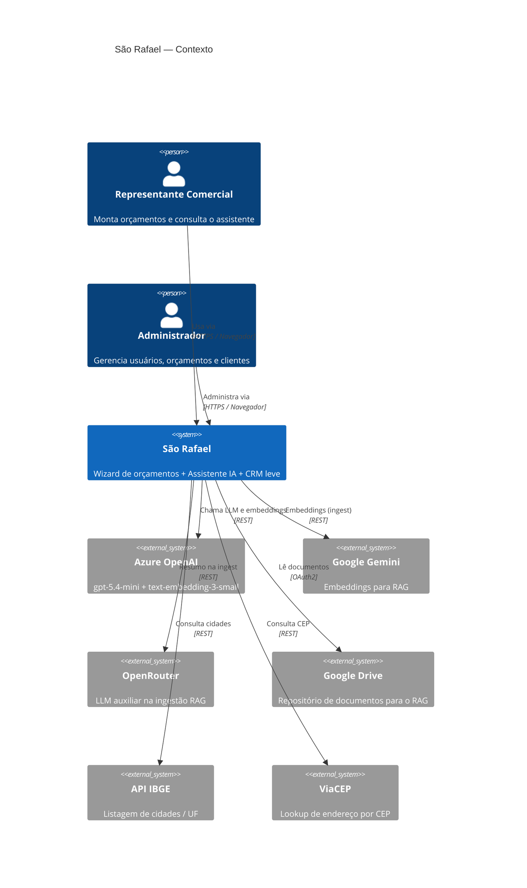
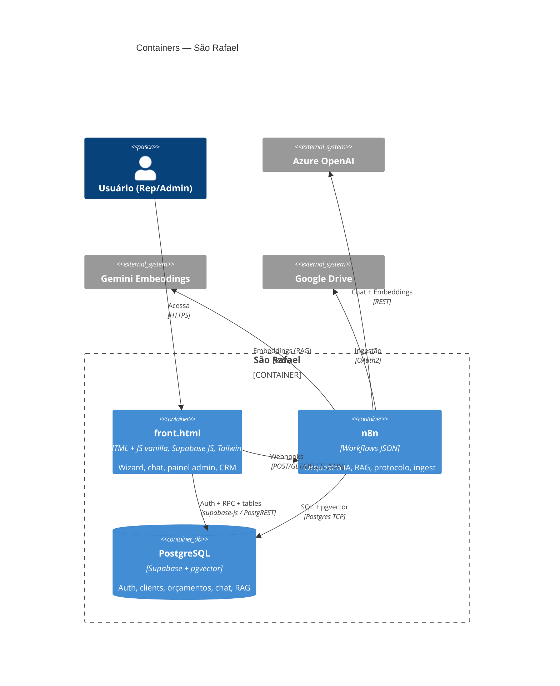
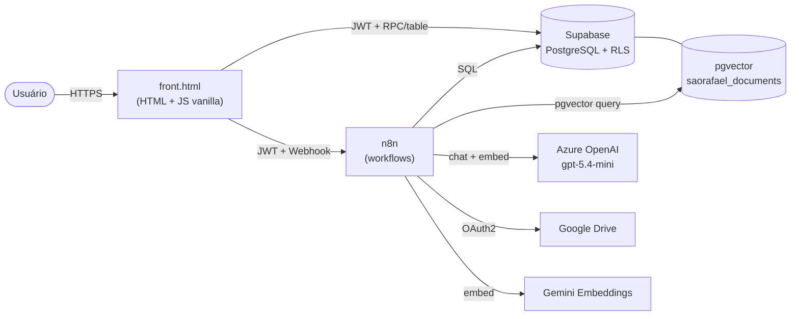
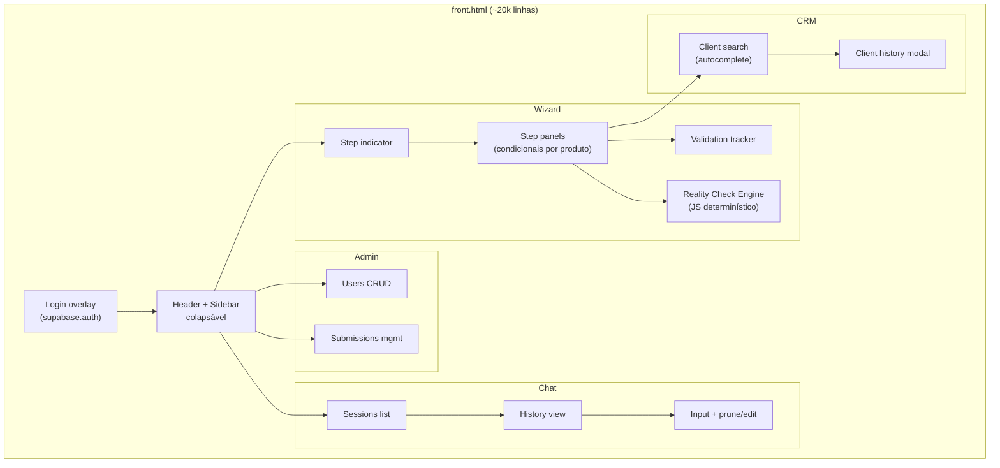
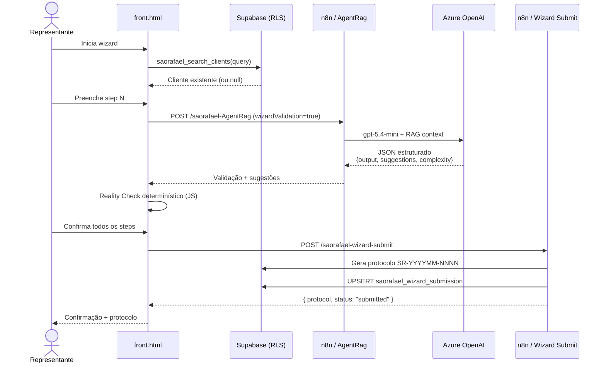
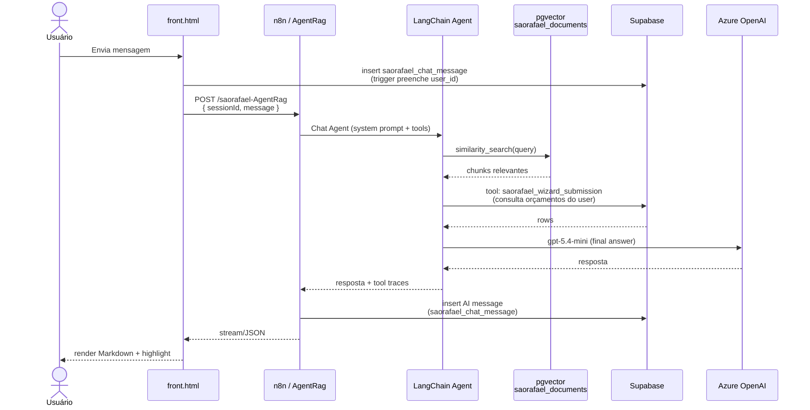
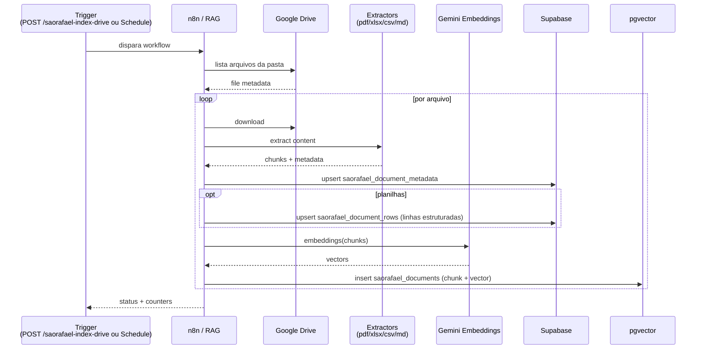
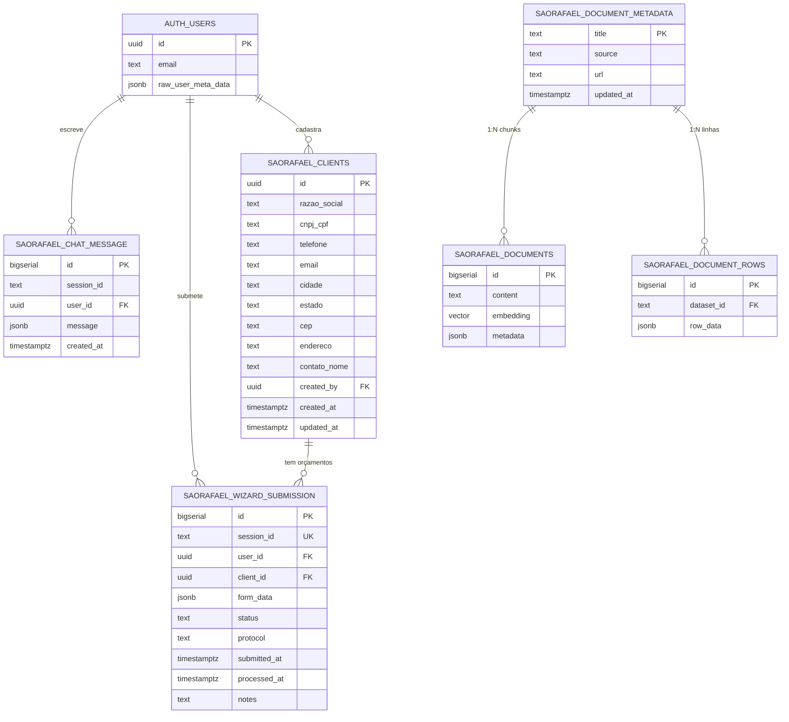
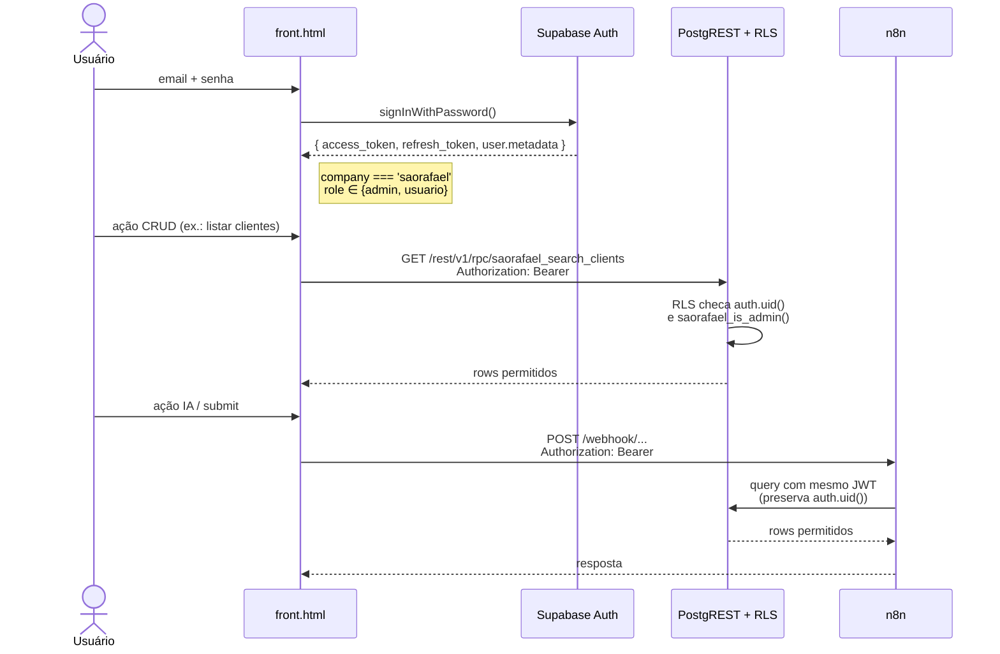

# Arquitetura — São Rafael

> Setup e uso do dia-a-dia: [`README.md`](./README.md)
> Spec do redesenho em andamento: [`WIZARD_V2_ARCHITECTURE.md`](./WIZARD_V2_ARCHITECTURE.md)

## Visão Geral

São Rafael é um sistema **serverless-orchestrated**: não há backend tradicional. O frontend (HTML estático) fala diretamente com o **Supabase** para operações CRUD/autenticação protegidas por RLS, e fala com **webhooks n8n** quando precisa de IA, cálculo determinístico de protocolo ou ingestão de documentos. O n8n hospeda a *lógica orquestral* (validação por IA, ingestão RAG, geração de protocolos, setup de banco), enquanto o **Supabase** hospeda *estado* (usuários, clientes, orçamentos, histórico de chat, vetores RAG).

Esse desenho tem três trade-offs principais:

- **+** Zero servidor próprio: deploy e operação se resumem a Supabase + n8n + um HTML hospedado.
- **+** Segurança forte por RLS: o frontend pode falar direto com o banco sem expor risco, pois cada tabela tem policies por papel.
- **−** A "lógica de negócio" se espalha entre SQL (RPCs), JSON (workflows n8n) e JS (frontend). É preciso disciplina para manter as três camadas em sintonia (especialmente prompts vs. RAG vs. validação).

## Diagrama de Contexto (C4 — Nível 1)

## Diagrama de Containers (C4 — Nível 2)

## Comunicação entre Componentes

## Estrutura Interna do Frontend (`front.html`)

## Fluxo: Submeter um Orçamento

## Fluxo: Chat com Assistente (com RAG)

## Fluxo: Ingestão RAG

## Diagrama de Entidades

## Fluxo de Autenticação e RLS

### Modelo de papéis

| Papel | `raw_user_meta_data` | Permissões |
|---|---|---|
| **anon** | — | Login apenas |
| **usuário comum** | `{ company: "saorafael", role: "usuario" }` | CRUD próprio (chat, submissions), leitura de clientes, edição do próprio nome |
| **admin** | `{ company: "saorafael", role: "admin" }` | Tudo acima + CRUD de usuários, leitura de todos os orçamentos, delete de clientes/orçamentos |
| **service_role** | (chave do projeto) | Bypass total — usado **apenas** pelo n8n |

A função `saorafael_is_admin()` é o predicado canônico — todas as policies admin a chamam.

## Agentes IA

Dois agentes vivem no workflow [`São Rafael - AgentRag (Wizard + Chat).json`](./workflows/) e compartilham a mesma infra (Azure OpenAI + Supabase pgvector + ferramentas Postgres):

| Agente | System prompt | Modelo | Stateful? | Saída |
|---|---|---|---|---|
| **Wizard Validation Agent** | [`prompts/system_prompt_wizard_validation.md`](./prompts/system_prompt_wizard_validation.md) | `gpt-5.4-mini` | Não (stateless por step) | JSON estruturado `{output, suggestions[], complexity}` |
| **Chat Assistant Agent** | [`prompts/system_prompt_chat_assistant.md`](./prompts/system_prompt_chat_assistant.md) | `gpt-5.4-mini` | Sim (memória em `saorafael_chat_message`) | Markdown pt-BR |

Ambos têm acesso a:
- **Vector store tool** sobre `saorafael_documents` (RAG)
- **Postgres tool** sobre `saorafael_wizard_submission` (consulta de orçamentos do usuário)
- **Postgres tool** sobre `saorafael_document_metadata` (catálogo de fontes RAG)

A separação acontece via flag `wizardValidation: true|false` na payload do webhook `/saorafael-AgentRag`.

## Reality Check Engine

Independente da IA, o frontend executa um motor de validação **determinístico em JavaScript** sobre o `formData` ao final de cada step. Ele aplica:

- Regras dimensionais (módulos múltiplos de 56cm, altura mínima/máxima por temperatura)
- Combinações proibidas (ex.: piso isolado + temperatura positiva, painel 50mm + congelamento profundo)
- Coerência comercial (descontos > X% exigem aprovação, frete CIF/FOB vs. UF do cliente)
- Cálculo de **fit score** (0–100) e severidade (`ok | warn | block`)

Resultado `block` impede o submit; `warn` pede confirmação. A spec completa está em [`WIZARD_V2_ARCHITECTURE.md`](./WIZARD_V2_ARCHITECTURE.md), seção *Reality Check Engine*.

## Decisões de Arquitetura

### ADR-001: Frontend monolítico em HTML único
- **Status:** Aceito
- **Contexto:** Equipe pequena, deploys frequentes, ambiente do cliente sem build pipeline.
- **Decisão:** Manter `front.html` como artefato único, sem bundler. Dependências via CDN.
- **Consequências:** + Deploy é copiar 1 arquivo. − Difícil escalar para múltiplos devs no mesmo arquivo; pré-V2 está atingindo limite de manutenção (~20k linhas). O Wizard V2 planeja modularizar em scripts separados.

### ADR-002: n8n como backend orquestrado
- **Status:** Aceito
- **Contexto:** Necessidade de integrar Azure OpenAI, Google Drive, Postgres, embeddings, sem manter um serviço HTTP próprio.
- **Decisão:** Cada endpoint é um workflow n8n. Lógica versionada como JSON.
- **Consequências:** + Sem código a deployar. + Observabilidade visual no n8n. − Diffs JSON são ruins de revisar; lógica complexa fica ilegível.

### ADR-003: RLS como camada primária de segurança
- **Status:** Aceito
- **Contexto:** Frontend público chama Supabase diretamente.
- **Decisão:** Toda tabela liga RLS; admin gating em `raw_user_meta_data`. Service role só no n8n.
- **Consequências:** + Defesa em profundidade real (vazar anon key não vaza dados). − Toda nova tabela exige migration de policies; já tivemos hotfixes ([`009`](migrations/009_fix_delete_policy.sql), [`010`](migrations/010_fix_chat_message_user_id.sql)).

### ADR-004: Prompts versionados em `.md`, não em JSON
- **Status:** Aceito
- **Contexto:** Iterar em prompt longo dentro do editor do n8n é doloroso.
- **Decisão:** Prompts canônicos vivem em `prompts/*.md`. O JSON do workflow recebe o conteúdo colado no node `set` correspondente.
- **Consequências:** + Diff legível, revisão em PR. − Precisa lembrar de propagar mudanças para o n8n (não há sync automático).

### ADR-005: Validação dupla (IA + determinística)
- **Status:** Aceito
- **Contexto:** Confiar só na IA gera variabilidade; só em regras hard-coded engessa.
- **Decisão:** Camada IA sugere e contextualiza; Reality Check (JS) tem a palavra final em bloqueios.
- **Consequências:** + Submits sempre tecnicamente válidos. − Custo cognitivo de manter as duas camadas em sintonia com o manual de engenharia.

## Segurança

- **Autenticação:** Supabase Auth (email + password). JWTs assinados pela chave do projeto. Refresh token automático pelo `supabase-js`.
- **Autorização:** RLS por tabela. Admin gate via `saorafael_is_admin()` lendo `raw_user_meta_data`. Frontend nunca toma a decisão sozinho — ele só esconde botões; o banco realmente bloqueia.
- **Dados sensíveis:** Não há cartão, CPF/CNPJ não é tratado como crítico mas está atrás de RLS. Telefones e e-mails de clientes só leitura para `authenticated`.
- **Comunicação interna:** n8n ↔ Supabase via TLS + service role key (armazenada como credencial). Frontend ↔ n8n via HTTPS + JWT do usuário (n8n repassa).
- **Segredos:** Apenas credenciais n8n. `front.html` carrega só anon key + URLs públicas. `.gitignore` veda `.env*` e chaves.

## Performance e Observabilidade

- **Cache:** Não há cache aplicacional. Supabase faz pooling no PostgREST.
- **Paginação:** Wizard tem volume baixo (centenas de orçamentos/mês). Listagens admin usam `limit/offset` na RPC.
- **RAG:** Embeddings reusados durante a sessão; `splitInBatches` no n8n para ingestão paralela. `pg_trgm` em `razao_social` para busca textual rápida (`011_clients_table_seed.sql`).
- **Observabilidade:** Cada execução de workflow fica auditável no painel n8n (status, logs, payloads). Supabase tem logs de query e Auth. Não há tracing distribuído.

## Riscos conhecidos e hotfixes históricos

- [`migrations/009_fix_delete_policy.sql`](migrations/009_fix_delete_policy.sql) — primeira versão das policies esqueceu o `DELETE` para admin em `saorafael_wizard_submission`. Hotfix dedicado.
- [`migrations/010_fix_chat_message_user_id.sql`](migrations/010_fix_chat_message_user_id.sql) — mensagens antigas tinham `user_id NULL`; a coluna foi reafirmada como nullable, o trigger reescrito, e os RPCs `saorafael_list_sessions/get_history/delete_session` foram recriados sem filtro estrito por `auth.uid()` para não esconder histórico legítimo. **Atenção:** isso reduz o isolamento por usuário no chat — revisitar quando houver tempo.
- Workflow [`SãoRafael-DatabaseSetup.json`](workflows/SãoRafael-DatabaseSetup.json) tem **SQL embutido com typos** em alguns nomes de tabela (`saorefael_*` em vez de `saorafael_*`). Não é usado no caminho feliz porque o setup recomendado é via migrations versionadas — mas se for executado em "modo full", validar antes.
- Migration `008` está ausente da pasta (pulo numérico). Histórico Git pode ter contexto; documentar quando recuperar.

## Roadmap Técnico

Resumo do que o [`WIZARD_V2_ARCHITECTURE.md`](./WIZARD_V2_ARCHITECTURE.md) descreve:

1. **Step inicial de identificação do cliente** com busca, histórico e "duplicar como base".
2. **Steps condicionais por tipo de produto** (Câmara, Walk-In, Túnel, Sala Climatizada, etc.).
3. **Módulos visuais interativos** para dimensões, portas, prateleiras e divisões.
4. **Reality Check Engine multi-camada** com severidade `ok/warn/block` e fit score 0–100.
5. **Contrato com a IA** padronizado em JSON estrito.
6. **Migração de dados** preservando submissions existentes.
7. **Export** (PDF do orçamento, XLSX com a planilha técnica preenchida).
