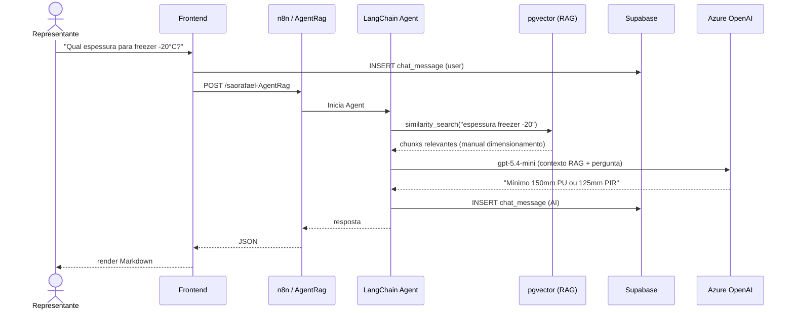
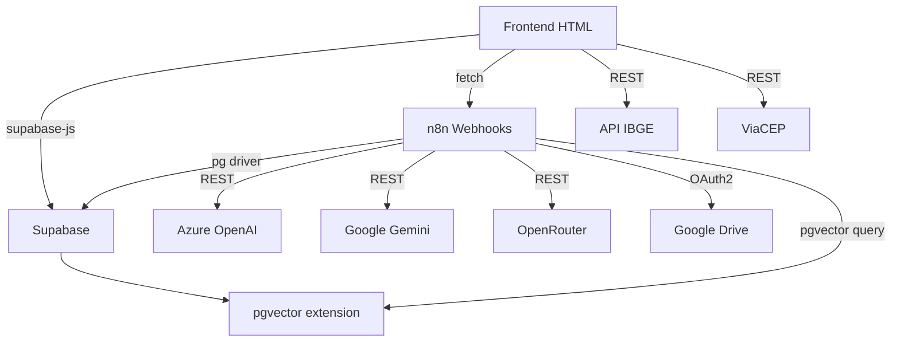
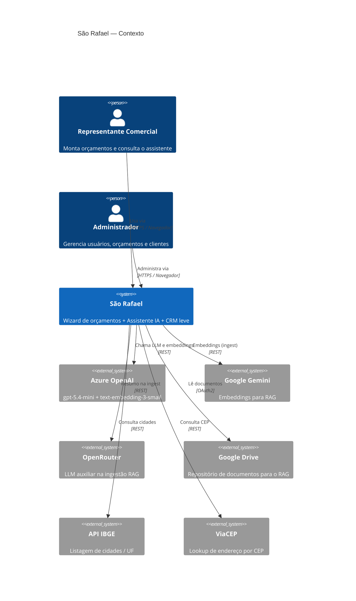
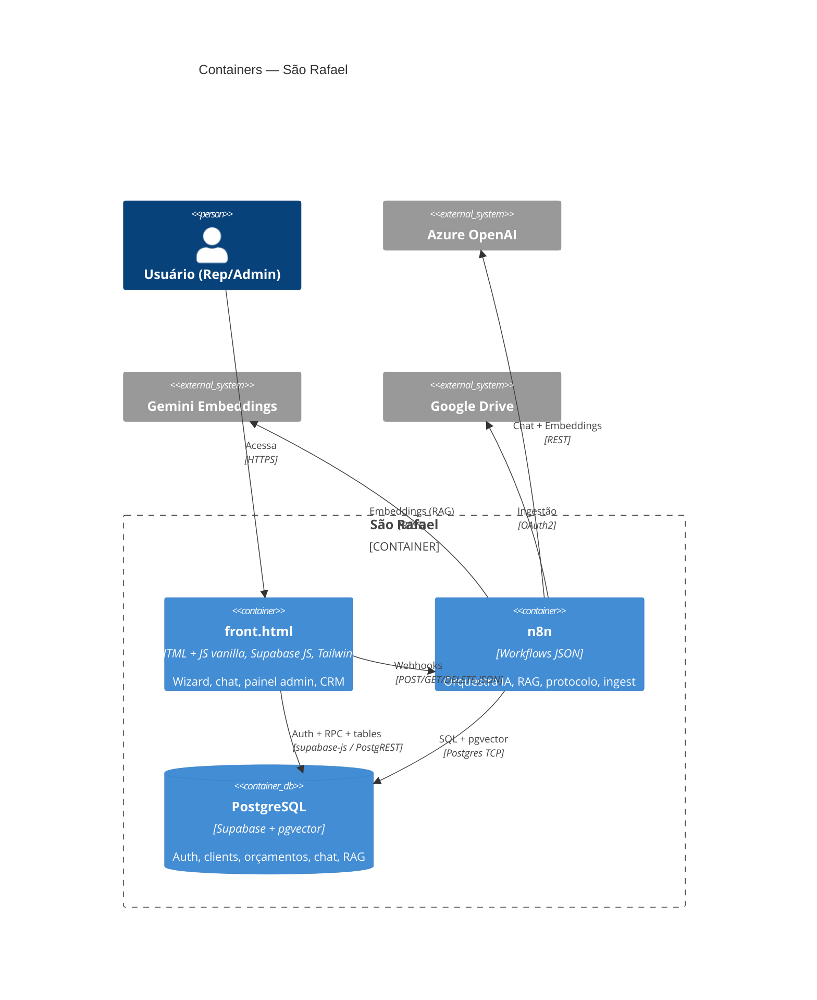
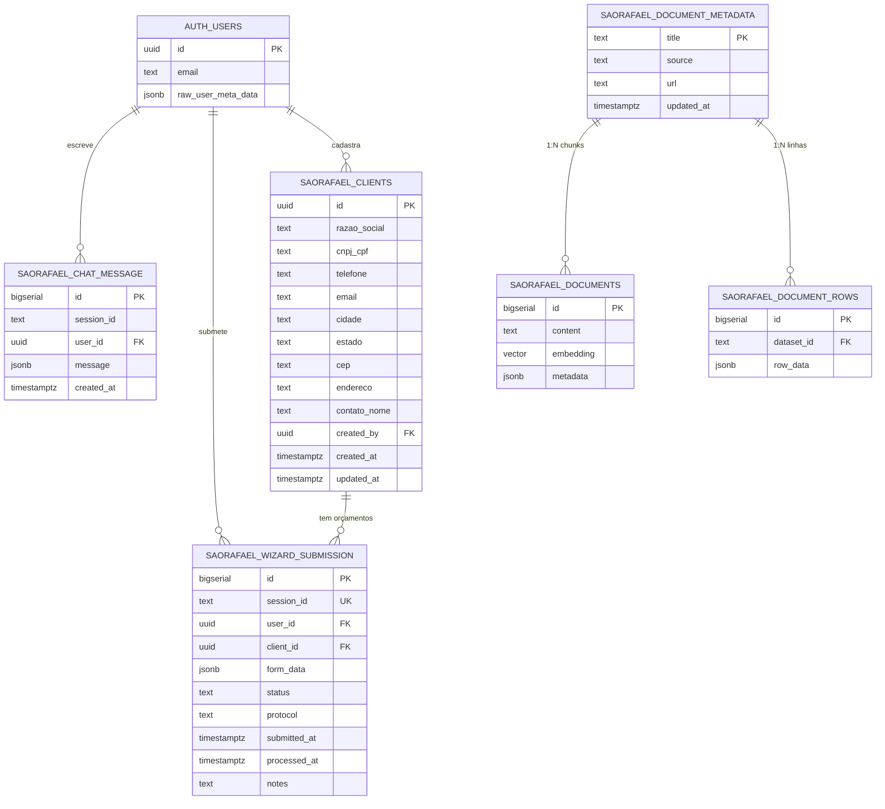
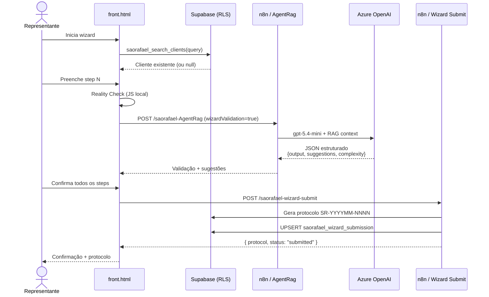
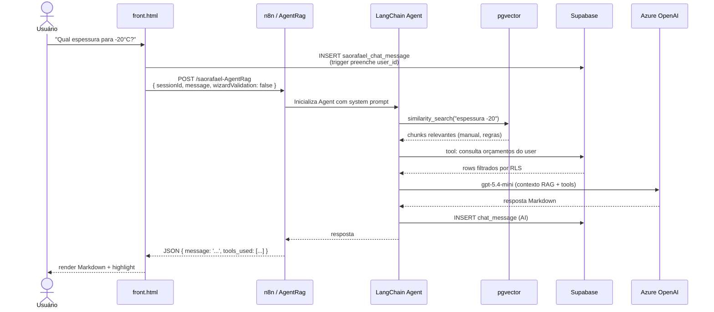
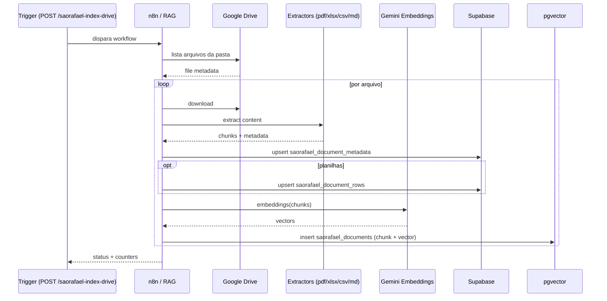

\newpage

# Sumário Executivo

**São Rafael** é uma plataforma web para geração assistida de orçamentos de câmaras frigoríficas, walk-in coolers, túneis de congelamento e equipamentos correlatos. O sistema combina um **wizard guiado** para representantes comerciais montarem propostas técnicas válidas com um **assistente conversacional de IA** que responde dúvidas sobre dimensionamento, especificações e normas técnicas.

## O que é

Sistema de orçamento inteligente para câmaras frigoríficas e equipamentos de refrigeração industrial, com validação técnica automatizada por IA e base de conhecimento indexada (RAG).

## Para quem

- **Representantes comerciais**: montam orçamentos completos de forma guiada
- **Equipe técnica**: consultam especificações e regras de dimensionamento
- **Administradores**: gerenciam usuários, clientes e orçamentos submetidos

## Valor entregue

1. **Reduz erros técnicos**: validação por IA detecta incompatibilidades (espessura x temperatura, fluido x faixa operacional, dimensões fora da grade modular)
2. **Acelera o processo comercial**: wizard em 6 etapas com auto-preenchimento e sugestões contextuais
3. **Democratiza conhecimento técnico**: assistente de chat responde dúvidas complexas sobre painéis, compressores, carga térmica e normas
4. **Centraliza histórico de clientes**: CRM leve com busca fuzzy, histórico de orçamentos e duplicação de propostas

## Stack resumida

- **Frontend**: HTML único (vanilla JS + Tailwind CSS via CDN)
- **Orquestração**: n8n (workflows JSON — cada endpoint é um webhook)
- **Banco de dados**: Supabase (PostgreSQL 15+ com RLS + pgvector)
- **IA**: Azure OpenAI (gpt-5.4-mini) + LangChain Agent + RAG (Gemini Embeddings)
- **Infraestrutura**: Serverless-friendly — sem backend tradicional a compilar

\newpage

---

# Visão de Negócio

## 1. Propósito e Problema Resolvido

### Contexto

A **São Rafael** é fabricante de câmaras frigoríficas, equipamentos de refrigeração e climatização. O processo tradicional de orçamento envolve:

1. Representante comercial coleta dados do cliente
2. Preenche planilha Excel complexa (~50 campos) com regras técnicas
3. Envia para engenharia validar (painéis, espessuras, carga térmica, sistema de refrigeração)
4. Planilha gera o orçamento final
5. Volta e meia há retrabalho por incompatibilidades técnicas não detectadas no ato do preenchimento

### Problema

- **Alta taxa de erro**: representantes sem formação técnica cometem erros (ex.: painel 50mm para -18°C, porta maior que a câmara, fluido fora da faixa operacional)
- **Retrabalho**: orçamentos voltam da engenharia para correção, atrasando o fechamento comercial
- **Conhecimento disperso**: manuais de dimensionamento, regras de negócio e especificações técnicas estão em PDFs, planilhas e memória tácita da equipe
- **Falta de histórico**: dados de clientes e orçamentos anteriores não estão centralizados

### Solução

Sistema web com **validação técnica em tempo real**:

- **Wizard guiado** que só permite avançar quando a etapa estiver tecnicamente coerente
- **IA valida cada step** cruzando com manual de dimensionamento, catálogos e regras comerciais
- **Motor determinístico (Reality Check)** calcula carga térmica, grade modular, espessuras mínimas e bloqueia submissões inválidas
- **Assistente de chat com RAG** para tirar dúvidas sobre especificações, normas e heurísticas por segmento (frigorífico, laticínio, farmacêutico, etc.)
- **CRM leve** com busca de clientes, histórico de orçamentos e duplicação de propostas

### Resultado esperado

- Reduzir taxa de erro técnico em orçamentos de ~30% para <5%
- Acelerar tempo médio de fechamento de proposta (menos retrabalho)
- Capacitar representantes novos com menos dependência de mentoria presencial

---

## 2. Atores e Papéis

| Ator | Perfil | Permissões | Cenário Típico |
|------|--------|------------|----------------|
| **Representante / Vendedor** | `{ role: "usuario", company: "saorafael" }` | Criar e editar próprios orçamentos, consultar clientes, usar assistente de chat | Preenche wizard para cliente, consulta dimensionamento via chat, submete orçamento para aprovação interna |
| **Administrador** | `{ role: "admin", company: "saorafael" }` | CRUD de usuários, leitura de todos os orçamentos, gestão de clientes, aprovação de propostas | Cria conta de novos representantes, consulta pipeline de orçamentos, aprova propostas antes de enviar ao cliente |
| **Sistema IA (Agente Wizard)** | (stateless, via service role) | Validação técnica read-only (não escreve no banco diretamente) | Recebe dados de uma etapa do wizard, cruza com RAG e retorna JSON estruturado com correções/sugestões |
| **Sistema IA (Agente Chat)** | (stateful, via service role) | Leitura de orçamentos do usuário, leitura de documentos RAG, escrita de mensagens | Responde perguntas sobre dimensionamento, consulta orçamentos anteriores, sugere valores para campos do wizard |

### Observação sobre RLS (Row-Level Security)

Todos os atores humanos acessam o banco **através de RLS**. O JWT do Supabase carrega `auth.uid()` e `raw_user_meta_data`, usados nas policies para filtrar rows por propriedade (`user_id`) e papel (`saorafael_is_admin()`).

Os agentes IA acessam via **service role key** (bypass de RLS), mas o frontend repassa o JWT do usuário ao n8n, que o usa para queries filtradas. **Defesa em profundidade**: vazar a anon key pública não vaza dados sensíveis.

---

## 3. Jornadas e Fluxos Principais

### 3.1 Jornada: Criar Novo Orçamento

```mermaid
flowchart TD
    A[Representante faz login] --> B[Clica "Novo Orçamento"]
    B --> C{Cliente já existe?}
    C -->|Sim| D[Busca cliente por CNPJ/nome/tel]
    D --> E[Seleciona cliente]
    E --> F[Dados cadastrais pré-preenchidos]
    C -->|Não| G[Cadastra novo cliente inline]
    G --> F
    F --> H[Wizard Etapa 1: Dados Comerciais]
    H --> I[Seleciona tipo_produto, comissões, vendedor]
    I --> J[IA valida etapa 1]
    J --> K{Bloqueio?}
    K -->|Sim| L[Corrige campos flagados]
    L --> J
    K -->|Não| M[Avança para Etapa 2]
    M --> N[Etapa 2: Logística e Cadastro]
    N --> O[... até Etapa 6]
    O --> P[Reality Check final]
    P --> Q{Bloqueia?}
    Q -->|Sim| R[Corrige problemas]
    R --> P
    Q -->|Não| S[Submete orçamento]
    S --> T[Sistema gera protocolo SR-YYYYMM-NNNN]
    T --> U[Salva em saorafael_wizard_submission]
    U --> V[Confirmação exibida ao usuário]
```

**Etapas do Wizard (V1 — 6 steps fixos)**:

1. **Dados Comerciais**: Tipo de produto, comissões, vendedor responsável
2. **Cadastro e Logística**: Cliente, endereço, prazo de pagamento, resumo técnico
3. **Especificações Construtivas**: Dimensões (modular), espessura de painel, revestimentos, piso, iluminação
4. **Acessórios e Fechamentos**: Portas, cortinas, estantes, alarmes
5. **Instalação e Frete**: Andar, transporte vertical, horário, distância
6. **Sistema de Refrigeração**: Compartimentos (temperatura, fluido, compressor, degelo, tensão)

**Reality Check (engine JS determinístico)**: Executa após cada etapa, calcula volume, área, carga térmica, valida grade modular, detecta incoerências. Bloqueia submit se houver **error** (🔴), permite com aviso se houver **warning** (🟡).

---

### 3.2 Jornada: Consultar Assistente IA (Chat com RAG)



**Ferramentas disponíveis para o Agent**:

- `buscar_documentos_tecnicos`: Consulta pgvector (RAG) — manuais, catálogos, regras de negócio
- `listar_orcamentos`: Retorna últimos 20 orçamentos do usuário (protocolo, tipo, cliente, status)
- `detalhe_orcamento`: Dado um protocolo, retorna JSON completo do `form_data`
- `consulta_avancada_sql`: Permite filtros complexos (período, tipo de produto, vendedor)

O agente é **stateful**: histórico da sessão fica salvo em `saorafael_chat_message`, permitindo contexto multi-turno.

---

### 3.3 Jornada: Administrador Gerencia Usuários

```mermaid
flowchart TD
    A[Admin faz login] --> B[Painel Admin visível]
    B --> C[Lista usuários existentes]
    C --> D[Clica "Criar Novo Usuário"]
    D --> E[Preenche email, senha, nome, empresa, role]
    E --> F[Chama RPC saorafael_create_user]
    F --> G{Sucesso?}
    G -->|Sim| H[Usuário criado no Supabase Auth]
    H --> I[raw_user_meta_data preenchido]
    I --> J[Notificação de sucesso]
    G -->|Não| K[Erro exibido: email já existe]
```

**RPC administrativas** (via `002_user_crud_functions.sql`):

- `saorafael_create_user(p_email, p_password, p_company, p_role, p_full_name)`: Cria usuário via SQL
- `saorafael_update_user(p_user_id, p_company, p_role, p_full_name)`: Atualiza metadados
- `saorafael_delete_user(p_user_id)`: Apaga usuário (requer admin)
- `saorafael_list_users()`: Lista todos os usuários com empresa e papel

Apenas admins (`saorafael_is_admin() = true`) podem chamar essas RPCs. Usuários comuns só podem atualizar o próprio nome via `saorafael_self_update_name()`.

---

### 3.4 Jornada: Cliente Recorrente (Duplicar Orçamento)

**Contexto**: Cliente ABC já fez 3 orçamentos. Representante quer criar um novo baseado no último.

1. Representante busca "ABC" na tela inicial
2. Sistema retorna cliente com histórico de orçamentos
3. Clica "Ver Histórico" → modal com lista de orçamentos anteriores
4. Seleciona orçamento SR-202603-0012 (status: Faturado)
5. Clica "Duplicar como Base"
6. Wizard abre **pré-preenchido** com todos os dados daquele orçamento
7. Representante ajusta dimensões ou temperatura conforme novo pedido
8. Submete novo orçamento (novo `session_id` e protocolo)

**Vantagem**: Evita redigitar dados cadastrais, tipo de produto, acessórios padrão. Acelera variações de um projeto-base.

---

## 4. Regras de Negócio

### 4.1 Regras Técnicas (Validação de Engenharia)

| Regra | Severidade | Origem | Exemplo |
|-------|-----------|--------|---------|
| **Dimensões modulares** | 🔴 Bloqueante | Reality Check Engine | Comprimento e largura devem ser múltiplos de 0,28m a partir de 1,12m. Altura múltiplos de 0,05m. Se não, a planilha não consegue calcular quantidade de painéis. |
| **Espessura mínima por temperatura** | 🔴 Bloqueante | RAG (01_manual_dimensionamento.md) | Congelamento -18°C exige mínimo 150mm PU ou 125mm PIR. Espessura menor causa condensação externa e perda de eficiência. |
| **Porta menor que câmara** | 🔴 Bloqueante | Reality Check Engine | `porta_largura + 300mm <= min(comprimento, largura)` e `porta_altura + 200mm <= altura`. Valores maiores = impossível instalar. |
| **Piso isolado obrigatório para temp < 0°C** | 🔴 Bloqueante | RAG (01_manual_dimensionamento.md, seção 4.2) | "Sem Piso" + temperatura negativa = condensação, gelo no solo, destruição do piso da edificação. |
| **Fluido dentro da faixa operacional** | 🔴 Bloqueante | RAG (01_manual_dimensionamento.md, seção 7.2) | R-134a opera entre -10°C e +15°C. Usar para -25°C = evaporador insuficiente. |
| **Revestimento por corrosividade** | 🟡 Recomendação | RAG (01_manual_dimensionamento.md, seção 3) | Amônia (R-717) exige Inox 304+. Galvalume + amônia = corrosão rápida. |
| **Iluminação mínima por área** | 🟡 Recomendação | Reality Check Engine | 1 luminária LED 36W (4500 lm) a cada ~6-8m² para congelamento. Subdimensionar compromete segurança e NR-17. |
| **Comissão total <= 15%** | 🟡 Alerta comercial | RAG (02_regras_negocio_planilha.md) | Vendedor 10% + Representante 6% = 16% → acima do padrão, avisar gerente. |

### 4.2 Regras Comerciais

| Regra | Descrição | Implementação |
|-------|-----------|---------------|
| **Protocolo único** | Formato `SR-YYYYMM-NNNN` (ano-mês-sequencial). Gerado pelo workflow `Wizard Submit` via query SQL: `SELECT COALESCE(MAX(...), 0) + 1 FROM saorafael_wizard_submission WHERE protocol LIKE 'SR-202606-%'` | `São Rafael - Wizard Submit (Save Orçamento).json` |
| **Upsert por session_id** | Se representante resubmeter o mesmo orçamento (mesma sessão de chat), faz UPDATE ao invés de INSERT. Preserva protocolo original. | `UPSERT saorafael_wizard_submission WHERE session_id = ?` |
| **DIFAL automático** | `local_instalacao_municipio` (formato "Cidade/UF") alimenta cálculo de ICMS/DIFAL na planilha. UF diferente da sede São Rafael = aplicar diferencial. | Campo `step2.local_instalacao_municipio` |
| **Prazo de pagamento afeta desconto** | "À Vista" = desconto financeiro maior. "30/60/90" = diferimento menor. Planilha calcula automaticamente. | Campo `step2.prazo_pagamento` |
| **Validade da proposta padrão: 15 dias** | Pode ser ajustada para 5, 10, 30 dias. Após expirar, orçamento precisa ser recotado (preços podem ter mudado). | Campo `step1.validade_proposta` |

### 4.3 Regras de Segurança

| Regra | Implementação | Observação |
|-------|---------------|------------|
| **Autenticação obrigatória** | Todo endpoint (exceto health-check) exige JWT do Supabase. Frontend chama `supabase.auth.signInWithPassword()` e armazena token em localStorage. | `front.html` linhas ~50-150 |
| **RLS por user_id** | Tabelas `saorafael_chat_message` e `saorafael_wizard_submission` têm policies que filtram por `auth.uid()`. Usuário só vê próprios registros. | `003_rls_policies.sql` |
| **Admin gate** | Função `saorafael_is_admin()` lê `raw_user_meta_data->>'role'`. Se `!= 'admin'`, policies bloqueiam. Frontend esconde botões, mas banco realmente bloqueia. | `002_user_crud_functions.sql` linha 1-10 |
| **Service role isolado** | Chave `service_role` (bypass RLS) só usada pelo n8n em credenciais protegidas. Frontend carrega apenas `anon key` pública. | n8n credentials + `front.html` linha ~30 |

---

## 5. Entidades de Domínio (Glossário de Negócio)

| Entidade | Descrição | Atributos-Chave |
|----------|-----------|-----------------|
| **Orçamento (Wizard Submission)** | Proposta comercial completa de um equipamento/câmara. Passa por validação técnica e gera protocolo único. | `protocol`, `tipo_produto`, `dimensoes`, `cliente_id`, `status`, `form_data` (JSON completo) |
| **Cliente** | Empresa ou pessoa física que solicita orçamento. Pode ter múltiplos orçamentos ao longo do tempo. | `razao_social`, `cnpj_cpf`, `cidade/estado`, `telefone`, `contato_nome`, histórico de orçamentos |
| **Sessão de Chat** | Conversa multi-turno entre representante e assistente IA. Identificada por `session_id` (UUID). | `session_id`, mensagens (array de `{type: 'human'\|'ai', content: '...'}`), `user_id` |
| **Compartimento** | Divisão interna de uma câmara com temperatura independente. Cada compartimento tem sistema de refrigeração próprio. | `temperatura_operacional`, `fluido_refrigerante`, `tipo_compressor`, `tipo_degelo`, `tensao` |
| **Painel Isotérmico** | Componente modular de parede/teto/piso. Define isolamento térmico. | `espessura` (mm), `tipo_isolamento` (PU/PIR), `revestimento_interno`, `revestimento_externo` |
| **Documento RAG** | Chunk de conhecimento técnico indexado para o assistente IA. | `content` (texto), `embedding` (vetor), `metadata` (fonte, título, página) |
| **Usuário** | Representante ou admin da São Rafael. Autenticado via Supabase Auth. | `email`, `full_name`, `company` ("saorafael"), `role` ("admin"\|"usuario") |

---

## 6. Casos de Uso Detalhados

### CU-001: Representante valida dimensões no wizard

**Ator**: Representante  
**Pré-condição**: Usuário logado, preenchendo Etapa 3 (Especificações Construtivas)  
**Fluxo principal**:

1. Usuário digita `comprimento = 3.50m`
2. Frontend detecta campo alterado
3. Reality Check Engine calcula: `(3.50 - 1.12) / 0.28 = 8.5` → **não é inteiro**
4. Marca campo com 🔴 "Dimensão fora da grade modular"
5. Sugere alternativas: `3.36m` (8 módulos) ou `3.64m` (9 módulos)
6. Usuário clica chip "3.36m"
7. Campo atualizado, validação 🟢
8. Botão "Avançar" fica habilitado

**Pós-condição**: Dimensões válidas, planilha conseguirá calcular quantidade de painéis.

---

### CU-002: IA sugere espessura de painel

**Ator**: Representante + IA  
**Pré-condição**: Etapa 3 preenchida, temperatura de -18°C definida na Etapa 6  
**Fluxo principal**:

1. Usuário preenche `espessura_painel = 100mm`
2. Clica "Validar com IA"
3. Frontend envia payload para n8n `/saorafael-AgentRag` com `wizardValidation: true`
4. IA Agent recebe `allData` (todas as etapas) e `stepSchema` (Etapa 3)
5. Agent cruza: `step6.compartimentos[0].temperatura = -18°C` → consulta RAG "espessura mínima congelamento"
6. RAG retorna: "Mínimo 150mm PU ou 125mm PIR para -18°C"
7. Agent retorna JSON:
   ```json
   {
     "output": "🔴 **espessura_painel**: 100mm insuficiente para -18°C. Mínimo 150mm PU.",
     "suggestions": [{
       "field": "espessura_painel",
       "value": "150",
       "reason": "Temperatura -18°C exige mínimo 150mm PU conforme manual",
       "severity": "critical",
       "alternatives": [
         {"value": "125", "reason": "Se usar PIR (mais caro)"}
       ]
     }]
   }
   ```
8. Frontend exibe sugestão com chip clicável "150mm"
9. Usuário clica, campo atualizado
10. Validação 🟢

**Pós-condição**: Espessura adequada, sem risco de condensação ou perda térmica.

---

### CU-003: Consultar histórico de cliente

**Ator**: Representante  
**Pré-condição**: Cliente ABC já possui orçamentos anteriores  
**Fluxo principal**:

1. Usuário digita "ABC" na busca de clientes (tela inicial)
2. Frontend chama RPC `saorafael_search_clients('ABC')`
3. Supabase retorna:
   ```json
   [{
     "id": "uuid-123",
     "razao_social": "Frigorífico ABC Ltda",
     "cnpj_cpf": "12.345.678/0001-90",
     "total_orcamentos": 3,
     "ultimo_orcamento": "2026-03-15T10:30:00Z"
   }]
   ```
4. Usuário clica "Ver Histórico"
5. Frontend chama RPC `saorafael_client_submissions('uuid-123')`
6. Supabase retorna array de orçamentos:
   ```json
   [
     {"protocol": "SR-202603-0012", "status": "completed", "tipo_produto": "Câmara com Sistema", ...},
     {"protocol": "SR-202601-0005", "status": "cancelled", ...}
   ]
   ```
7. Modal exibe lista com protocolos, tipos, datas, status
8. Usuário clica "Duplicar como Base" no SR-202603-0012
9. Frontend carrega `form_data` daquele orçamento
10. Wizard abre pré-preenchido

**Pós-condição**: Novo orçamento criado com dados-base do anterior, acelerando processo.

---

\newpage

---

# Visão Técnica

## 1. Stack e Dependências

### 1.1 Visão Geral

| Camada | Tecnologia | Versão | Propósito |
|--------|-----------|--------|-----------|
| **Frontend** | HTML + JavaScript vanilla | ES2022+ | UI única (~20k linhas), sem bundler |
| **Estilo** | Tailwind CSS | 3.x (via CDN) | Utilitary-first CSS |
| **Markdown Rendering** | Marked.js | — | Renderizar respostas do chat |
| **Syntax Highlight** | Highlight.js | — | Code blocks no chat |
| **Ícones** | Lucide | — (CDN) | Ícones SVG |
| **Planilhas** | SheetJS (xlsx.js) | — | Parsear uploads Excel/CSV |
| **Auth & DB** | Supabase JS Client | 2.x | Autenticação + PostgREST |
| **Backend Orquestração** | n8n | Self-hosted | Workflows JSON (webhooks REST) |
| **Banco de Dados** | PostgreSQL | 15+ (Supabase) | RLS + pgvector |
| **Vector Store** | pgvector | 0.5+ | Embeddings para RAG |
| **LLM — Wizard** | Azure OpenAI | API 2024-02-01 | `gpt-5.4-mini` validação |
| **LLM — Chat** | Azure OpenAI | API 2024-02-01 | `gpt-5.4-mini` + LangChain Agent |
| **Embeddings** | Azure OpenAI + Google Gemini | — | `text-embedding-3-small` + Gemini Embeddings |
| **LLM Auxiliar (RAG ingest)** | OpenRouter | — | Resumo/normalização na ingestão de docs |
| **APIs Externas** | IBGE, ViaCEP | REST público | Busca de cidades/UF, lookup CEP |

### 1.2 Dependências npm/pip (não aplicável)

Não há `package.json` nem `requirements.txt` — todas as libs do frontend vêm via CDN. O n8n gerencia suas próprias dependências internas (Node.js 18+ com pacotes pré-instalados: `@langchain/community`, `pg`, `axios`, etc.).

### 1.3 Diagrama de Dependências



---

## 2. Arquitetura Geral

### 2.1 Diagrama de Contexto (C4 — Nível 1)



### 2.2 Diagrama de Containers (C4 — Nível 2)



### 2.3 Padrão Arquitetural

**Serverless-Orchestrated**:

- Não há servidor HTTP tradicional (Express, FastAPI, etc.)
- Frontend estático (HTML) fala diretamente com Supabase (PostgREST) para CRUD
- Lógica complexa (IA, RAG, protocolo) fica em workflows n8n (cada webhook = endpoint)
- Estado vive no PostgreSQL (Supabase)

**Vantagens**:
- Zero servidor próprio a manter (deploy = copiar HTML + importar JSONs no n8n)
- RLS do Postgres garante segurança mesmo com frontend público
- Observabilidade visual (n8n UI mostra execuções, logs, payloads)

**Desvantagens**:
- Lógica de negócio espalhada entre SQL (RPCs), JSON (workflows) e JS (frontend + Reality Check)
- Diffs de workflow JSON são ruins de revisar
- Debugging de fluxos complexos exige acessar painel do n8n

---

## 3. Estrutura de Pastas e Arquivos

```
SaoRafael/
├── front.html                    # ⭐ Aplicação completa (wizard + chat + admin) ~20k linhas
├── front_v2_backup.html          # Backup intermediário do Wizard V2 (~1.8k linhas)
├── front_backup_chat.html        # Backup da UI anterior centrada em chat (~3k linhas)
├── README.md                     # Setup e uso do dia-a-dia
├── ARCHITECTURE.md               # Arquitetura técnica detalhada (este documento foi extraído daí)
├── WIZARD_V2_ARCHITECTURE.md     # Spec de design do Wizard V2 (steps condicionais, CRM, Reality Check)
│
├── migrations/                   # ⚙️ SQL versionado — rodar em ordem no Supabase
│   ├── 000_ownership_guard.sql   # Função helper saorafael_is_admin()
│   ├── 001_base_tables.sql       # Tabelas chat + submission + view de sessões
│   ├── 002_user_crud_functions.sql # RPCs admin para gestão de usuários
│   ├── 003_rls_policies.sql      # Policies RLS por user/admin/service_role
│   ├── 004_auto_user_id_trigger.sql # Trigger BEFORE INSERT preenche user_id
│   ├── 005_session_management.sql # RPCs list/get/delete/prune sessões de chat
│   ├── 006_seed_admin.sql        # Bootstrap do primeiro admin
│   ├── 007_self_update_name.sql  # RPC usuário atualiza próprio nome
│   ├── 009_fix_delete_policy.sql # Hotfix: policy delete para admin em submissions
│   ├── 010_fix_chat_message_user_id.sql # Hotfix: user_id em chat + recriação de RPCs
│   ├── 011_clients_table_seed.sql # Tabela de clientes + FK + RPCs de busca + backfill
│   └── 012_clients_rls_policies.sql # RLS para clients
│
├── prompts/                      # 📝 System prompts dos agentes IA (versionados)
│   ├── system_prompt_chat_assistant.md
│   └── system_prompt_wizard_validation.md
│
├── rag_documents/                # 📚 Base de conhecimento para o RAG
│   ├── 01_manual_dimensionamento.md   # Engenharia: painéis, carga térmica, defrost
│   ├── 02_regras_negocio_planilha.md  # Contrato com a planilha + regras comerciais
│   └── 03_guia_interpretacao_casos.md # Heurísticas por setor (cárneo, lácteo, etc.)
│
└── workflows/                    # 🔧 Workflows n8n (cada um é um conjunto de endpoints)
    ├── São Rafael - AgentRag (Wizard + Chat).json     # Endpoint principal de IA
    ├── São Rafael - Wizard Submit (Save Orçamento).json # POST /saorafael-wizard-submit
    ├── SãoRafael-Chat-DELETE-Session.json
    ├── SãoRafael-Chat-GET-History.json
    ├── SãoRafael-Chat-GET-Sessions.json
    ├── SãoRafael-DatabaseSetup.json                   # Migração automatizada + reset RAG
    ├── SãoRafael-Front.json                            # Serve o front.html via webhook
    └── SãoRafael-RAG.json                              # Ingestão e reindex de documentos
```

### Observação sobre `front.html`

Arquivo monolítico de **~20.000 linhas** contendo:

- HTML (estrutura completa da UI)
- CSS (inline no `<style>`, Tailwind + customizações)
- JavaScript (vanilla, ~18k linhas):
  - Autenticação Supabase
  - Wizard multi-etapa com validação progressiva
  - Reality Check Engine (cálculos determinísticos)
  - Chat com mensagens em tempo real
  - Painel admin (CRUD usuários/clientes/orçamentos)
  - CRM (busca de clientes, histórico, duplicação)

**Por que monolítico?**
- Decisão arquitetural (ADR-001): equipe pequena, deploys frequentes, sem build pipeline
- Deploy = copiar 1 arquivo
- Atingindo limite de manutenibilidade (Wizard V2 planeja modularizar)

---

## 4. Modelo de Dados (Entidades e Relacionamentos)

### 4.1 Diagrama ER



### 4.2 Tabelas Principais

#### `auth.users` (Supabase nativo)

| Coluna | Tipo | Descrição |
|--------|------|-----------|
| `id` | uuid | PK — identificador único do usuário |
| `email` | text | E-mail (login) |
| `encrypted_password` | text | Hash bcrypt da senha |
| `raw_user_meta_data` | jsonb | Metadados customizados: `{company, role, full_name}` |
| `created_at` | timestamptz | Data de criação |

**Valores de `raw_user_meta_data`**:
```json
{
  "company": "saorafael",
  "role": "admin" | "usuario",
  "full_name": "Nome Completo"
}
```

#### `saorafael_clients`

| Coluna | Tipo | Descrição |
|--------|------|-----------|
| `id` | uuid | PK |
| `razao_social` | text | Nome/Razão Social do cliente |
| `cnpj_cpf` | text | Documento (CNPJ ou CPF) — índice único quando preenchido |
| `inscricao_estadual` | text | IE (opcional) |
| `telefone` | text | Telefone de contato |
| `email` | text | E-mail do cliente |
| `cidade` | text | Cidade |
| `estado` | text | UF (sigla 2 letras) |
| `cep` | text | CEP |
| `endereco` | text | Endereço completo |
| `local_instalacao` | text | Município de instalação (usado para ICMS) |
| `contato_nome` | text | Nome do contato principal |
| `contato_telefone` | text | Telefone do contato |
| `contato_email` | text | E-mail do contato |
| `dados_tecnicos` | text | Resumo técnico livre |
| `observacoes` | text | Observações gerais |
| `created_by` | uuid | FK → `auth.users.id` |
| `created_at` | timestamptz | Data de cadastro |
| `updated_at` | timestamptz | Última atualização |

**Índices**:
- `idx_saorafael_clients_cnpj`: UNIQUE em `cnpj_cpf` (quando não-nulo)
- `idx_saorafael_clients_razao_trgm`: GIN trigram para busca fuzzy por nome
- `idx_saorafael_clients_telefone`: Busca por telefone

#### `saorafael_wizard_submission`

| Coluna | Tipo | Descrição |
|--------|------|-----------|
| `id` | bigserial | PK |
| `session_id` | text | UNIQUE — UUID da sessão de chat/wizard |
| `user_id` | uuid | FK → `auth.users.id` |
| `client_id` | uuid | FK → `saorafael_clients.id` (opcional) |
| `form_data` | jsonb | JSON completo do wizard (todas as 6 etapas) |
| `status` | text | `submitted` \| `processing` \| `completed` \| `error` |
| `protocol` | text | Protocolo gerado (formato `SR-YYYYMM-NNNN`) |
| `submitted_at` | timestamptz | Data de submissão |
| `processed_at` | timestamptz | Data de processamento/fechamento |
| `notes` | text | Notas internas (admin) |

**Estrutura do `form_data`**:
```json
{
  "step1": {
    "tipo_produto": "Walk In Freezer",
    "comissao_vendedor": 8,
    "comissao_representante": 5,
    "vendedor_responsavel": "João Silva",
    ...
  },
  "step2": { "razao_social": "...", "cnpj_cpf": "...", ... },
  "step3": { "comprimento": 3.36, "largura": 2.24, "altura": 2.50, ... },
  "step4": { "porta_tipo": "Giratória Isotérmica", ... },
  "step5": { "andar_instalacao": 0, ... },
  "step6": {
    "compartimentos": [
      {
        "temperatura_operacional": -18,
        "fluido_refrigerante": "R-404A",
        "tipo_compressor": "Hermético",
        "tipo_degelo": "Elétrico",
        "tensao": "220V Monofásico"
      }
    ]
  }
}
```

#### `saorafael_chat_message`

| Coluna | Tipo | Descrição |
|--------|------|-----------|
| `id` | bigserial | PK |
| `session_id` | text | UUID da sessão de chat |
| `user_id` | uuid | FK → `auth.users.id` (nullable por motivos históricos — ver hotfix 010) |
| `message` | jsonb | `{type: 'human'\|'ai', content: '...'}` |
| `created_at` | timestamptz | Timestamp da mensagem |

**Índices**:
- `idx_saorafael_chat_session`: `(session_id, created_at)` para ordenação
- `idx_saorafael_chat_user`: `(user_id)` para filtragem por usuário

#### `saorafael_documents` (Vector Store)

| Coluna | Tipo | Descrição |
|--------|------|-----------|
| `id` | bigserial | PK |
| `content` | text | Chunk de texto (até ~1500 chars) |
| `embedding` | vector(1536) | Vetor de embeddings (Azure OpenAI `text-embedding-3-small`) |
| `metadata` | jsonb | `{source, title, page, url, ...}` |

**Índice**:
- `idx_saorafael_documents_embedding_ivfflat`: IVFFlat para busca de similaridade vetorial

#### `saorafael_document_metadata`

| Coluna | Tipo | Descrição |
|--------|------|-----------|
| `title` | text | PK — título do documento (ex.: "01_manual_dimensionamento.md") |
| `source` | text | Origem (Google Drive, local, etc.) |
| `url` | text | URL do documento original |
| `updated_at` | timestamptz | Última atualização/reindex |

#### `saorafael_document_rows` (Linhas estruturadas de planilhas)

| Coluna | Tipo | Descrição |
|--------|------|-----------|
| `id` | bigserial | PK |
| `dataset_id` | text | FK → `saorafael_document_metadata.title` |
| `row_data` | jsonb | Linha completa da planilha como JSON |

---

### 4.3 Views

#### `saorafael_chat_sessions`

View materializada para listar sessões de chat com título inferido (primeira mensagem humana):

```sql
CREATE OR REPLACE VIEW saorafael_chat_sessions AS
SELECT
  session_id,
  MIN(created_at) AS data_inicio,
  MAX(created_at) AS data_ultimo,
  COUNT(*) AS total_mensagens,
  (SELECT m2.message->>'content'
   FROM saorafael_chat_message m2
   WHERE m2.session_id = m.session_id
     AND m2.message->>'type' = 'human'
   ORDER BY m2.created_at ASC
   LIMIT 1
  ) AS titulo
FROM saorafael_chat_message m
GROUP BY session_id
ORDER BY MAX(created_at) DESC;
```

Usada pelo frontend para popular a sidebar de histórico de conversas.

---

## 5. Fluxo de Requisição Completo

### 5.1 Fluxo: Submeter Orçamento



**Detalhamento por etapa**:

1. **Reality Check Local (JS)**:
   - Calcula volume, área, carga térmica estimada
   - Valida dimensões modulares
   - Detecta incoerências (porta > câmara, piso sem isolamento em temp negativa)
   - Retorna `{issues: [...], blocking: true|false, fit_score: 0-100}`

2. **Validação IA (opcional, ativada por botão)**:
   - Payload: `{wizardValidation: true, allData: {...}, stepSchema: {...}, currentStep: 3}`
   - IA cruza etapas anteriores, consulta RAG, retorna sugestões de correção
   - Frontend aplica sugestões com chips clicáveis

3. **Submit Final**:
   - Se Reality Check não bloquear (`blocking: false`), botão "Finalizar" habilitado
   - POST para `/saorafael-wizard-submit` com JWT + `session_id` + `form_data` completo
   - n8n gera protocolo sequencial do mês corrente
   - UPSERT por `session_id` (se resubmeter, atualiza o existente)

---

### 5.2 Fluxo: Chat com RAG



**Ferramentas disponíveis ao Agent**:

- `buscar_documentos_tecnicos(query)`: Consulta pgvector, retorna top-K chunks
- `listar_orcamentos_usuario()`: SELECT em `saorafael_wizard_submission` filtrado por `auth.uid()`
- `detalhar_orcamento(protocol)`: Retorna `form_data` completo de um protocolo
- `consulta_sql_avancada(sql)`: Executa SQL read-only (admin only)

---

### 5.3 Fluxo: Ingestão RAG (Google Drive → pgvector)



**Extractors por tipo**:

- **PDF**: `pdf-parse` node → chunks de ~1000 chars
- **XLSX/CSV**: SheetJS node → linhas estruturadas em `saorafael_document_rows` + chunks textuais
- **Markdown**: n8n `Read File` → chunks por seção `##`

**Embedding**:
- Azure OpenAI `text-embedding-3-small` (1536 dim) ou Google Gemini Embeddings (768 dim)
- OpenRouter usado para resumo/normalização durante chunking

**Reset completo**:
```bash
curl -X POST https://<seu-n8n>/webhook/saorafael-reset-rag
```
Trunca `saorafael_documents` e `saorafael_document_metadata`, depois reindexa do zero.

---

## 6. APIs / Endpoints (Webhooks n8n)

| Método | Rota | Workflow | Auth | Descrição |
|--------|------|----------|------|-----------|
| POST | `/saorafael-AgentRag` | AgentRag (Wizard + Chat) | Bearer JWT | Agente unificado: `wizardValidation: true` → validação de step; `false` → chat livre. Retorna JSON estruturado. |
| POST | `/saorafael-prune-history` | AgentRag | Bearer JWT | Apaga mensagens a partir de `messageId` (suporte a editar/regerar resposta). |
| POST | `/saorafael-wizard-submit` | Wizard Submit | Bearer JWT | Persiste orçamento final. Gera protocolo `SR-YYYYMM-NNNN`. Upsert por `session_id`. |
| GET | `/saorafael-sessions` | Chat-GET-Sessions | Bearer JWT | Lista sessões de chat do usuário com título inferido. |
| GET | `/saorafael-history?sessionId=` | Chat-GET-History | Bearer JWT | Histórico ordenado de uma sessão. |
| DELETE | `/saorafael-session?sessionId=` | Chat-DELETE-Session | Bearer JWT | Apaga todas as mensagens de uma sessão. |
| POST | `/saorafael-index-drive` | RAG | — | Ingestão/reindex incremental do Google Drive no vector store. |
| POST | `/saorafael-reset-rag` | RAG | — | Reseta o índice RAG e reindexa do zero. |
| POST | `/saorafael-DatabaseSetup` | DatabaseSetup | — | Aplica bundle SQL (`mode: "full" \| "rag_only"`). |
| GET | `/saorafael-chat` | Front | — | Serve o `front.html`. |
| GET | `/saorafael_health` | AgentRag | — | Health-check do agente. |

### 6.1 Exemplo de Payload: Validação de Step

**Request** (POST `/saorafael-AgentRag`):
```json
{
  "wizardValidation": true,
  "currentStep": 3,
  "stepName": "Especificações Construtivas",
  "allData": {
    "step1": { "tipo_produto": "Walk In Freezer", ... },
    "step2": { "razao_social": "Cliente ABC", ... },
    "step3": {
      "comprimento": 3.36,
      "largura": 2.24,
      "altura": 2.50,
      "espessura_painel": 100,
      ...
    }
  },
  "stepSchema": { "type": "static", "fields": [...] },
  "realityCheck": {
    "derived": { "volume_m3": 18.8, "area_piso_m2": 7.5 },
    "issues": [
      {
        "level": "warning",
        "category": "thermal",
        "message": "Espessura 100mm insuficiente para -18°C"
      }
    ],
    "counts": { "error": 0, "warning": 1, "info": 0 },
    "blocking": false
  }
}
```

**Response**:
```json
{
  "output": "## Validação da Etapa 3: Especificações Construtivas\n\n### Resumo\nDimensões modulares ✅ | Espessura precisa correção 🟡\n\n### Análise Detalhada\n- 🟢 **comprimento/largura/altura**: Dimensões válidas na grade modular (3.36m = 8 módulos, 2.24m = 4 módulos, 2.50m = 10 incrementos de 0.05m)\n- 🟡 **espessura_painel**: 100mm é tecnicamente viável para -18°C mas ABAIXO DO RECOMENDADO. O manual especifica mínimo 150mm PU para congelamento. Com 100mm há risco de:\n  - Condensação externa (geada na parede)\n  - Consumo energético 20-30% maior\n  - Perda de produto em caso de falha do compressor\n\n**Recomendação forte**: 150mm PU (ou 125mm PIR se orçamento permitir). Só manter 100mm se cliente aceitar termo de responsabilidade.\n\n### Cruzamento com Etapas Anteriores\n- Step 1 → Step 3: tipo_produto = Walk In Freezer ✅ coerente com temp -18°C\n- Step 6 (previsto): Sistema de refrigeração para -18°C exigirá compressor semi-hermético ou scroll\n\n### Conclusão\n✅ **Pode prosseguir**, mas ajustar espessura para 150mm antes do fechamento comercial reduzirá risco de reclamação pós-venda.",
  "suggestions": [
    {
      "field": "espessura_painel",
      "value": "150",
      "reason": "Mínimo técnico para -18°C conforme manual de dimensionamento. Evita condensação e garante eficiência.",
      "severity": "warning",
      "alternatives": [
        {
          "value": "125",
          "reason": "Se usar PIR (poliisocianurato) — melhor performance térmica, ~15% mais caro"
        }
      ]
    }
  ],
  "complexity_classification": {
    "level": "standard",
    "score": 32,
    "label": "Projeto Padrão",
    "factors": [
      { "factor": "walk_in_freezer", "impact": "+10", "reason": "Equipamento de linha" },
      { "factor": "dimensoes_modulares", "impact": "+5", "reason": "Dimensões padrão, não customizado" },
      { "factor": "temp_congelamento", "impact": "+10", "reason": "Temperatura -18°C (operação padrão)" },
      { "factor": "1_compartimento", "impact": "+0", "reason": "Compartimento único" },
      { "factor": "compressor_hermético", "impact": "+7", "reason": "Sistema simples" }
    ],
    "engineering_review_required": false,
    "recommendation": "Projeto de complexidade padrão. Representante pode fechar sozinho. Prazo de resposta: 2-3 dias úteis. Ajustar espessura para 150mm antes de enviar proposta ao cliente."
  }
}
```

---

## 7. RPCs do Supabase (Stored Procedures)

### 7.1 Gestão de Usuários (Admin)

| RPC | Parâmetros | Retorno | Descrição |
|-----|-----------|---------|-----------|
| `saorafael_create_user` | `p_email`, `p_password`, `p_company`, `p_role`, `p_full_name` | `uuid` | Cria usuário via SQL no `auth.users`. Admin only. |
| `saorafael_update_user` | `p_user_id`, `p_company`, `p_role`, `p_full_name` | `void` | Atualiza `raw_user_meta_data`. Admin only. |
| `saorafael_delete_user` | `p_user_id` | `void` | Apaga usuário e dependências. Admin only. |
| `saorafael_list_users` | — | `table(id, email, company, role, full_name)` | Lista todos os usuários. Admin only. |
| `saorafael_self_update_name` | `p_full_name` | `void` | Usuário atualiza próprio nome. Authenticated. |

**Implementação de `saorafael_create_user`** (trecho):
```sql
CREATE OR REPLACE FUNCTION saorafael_create_user(
  p_email TEXT,
  p_password TEXT,
  p_company TEXT DEFAULT 'saorafael',
  p_role TEXT DEFAULT 'usuario',
  p_full_name TEXT DEFAULT NULL
) RETURNS UUID
LANGUAGE plpgsql
SECURITY DEFINER
SET search_path = public, auth
AS $$
DECLARE
  v_user_id UUID;
BEGIN
  -- Verifica se usuário logado é admin
  IF NOT saorafael_is_admin() THEN
    RAISE EXCEPTION 'Acesso negado: apenas administradores podem criar usuários';
  END IF;

  -- Insere no auth.users
  INSERT INTO auth.users (
    instance_id,
    email,
    encrypted_password,
    email_confirmed_at,
    raw_user_meta_data,
    created_at,
    updated_at
  ) VALUES (
    '00000000-0000-0000-0000-000000000000',
    p_email,
    crypt(p_password, gen_salt('bf')),
    NOW(),
    jsonb_build_object(
      'company', p_company,
      'role', p_role,
      'full_name', COALESCE(p_full_name, p_email)
    ),
    NOW(),
    NOW()
  ) RETURNING id INTO v_user_id;

  RETURN v_user_id;
END;
$$;
```

---

### 7.2 Gestão de Clientes

| RPC | Parâmetros | Retorno | Descrição |
|-----|-----------|---------|-----------|
| `saorafael_search_clients` | `p_query` | `table(id, razao_social, cnpj_cpf, telefone, email, cidade, estado, total_orcamentos, ultimo_orcamento)` | Busca fuzzy de clientes (CNPJ, razão, telefone). Usa trigram (pg_trgm). |
| `saorafael_client_detail` | `p_client_id` | `row(todas as colunas)` | Detalhes completos de um cliente. |
| `saorafael_client_submissions` | `p_client_id` | `table(protocol, tipo_produto, submitted_at, status, ...)` | Orçamentos de um cliente. |
| `saorafael_upsert_client` | `p_id`, `p_razao_social`, ... | `uuid` | Cria ou atualiza cliente. Authenticated. |
| `saorafael_delete_client` | `p_client_id` | `void` | Apaga cliente + orçamentos vinculados. Admin only. |
| `saorafael_delete_submission_smart` | `p_id` | `void` | Apaga orçamento; se cliente fica órfão, apaga junto. Admin only. |

---

### 7.3 Gestão de Sessões de Chat

| RPC | Parâmetros | Retorno | Descrição |
|-----|-----------|---------|-----------|
| `saorafael_list_sessions` | — | `table(session_id, data_inicio, data_ultimo, total_mensagens, titulo)` | Usa view `saorafael_chat_sessions`. Authenticated. |
| `saorafael_get_history` | `p_session_id` | `table(id, message, created_at)` | Mensagens ordenadas de uma sessão. Authenticated. |
| `saorafael_delete_session` | `p_session_id` | `integer` | Apaga mensagens de uma sessão (retorna contagem). Authenticated. |
| `saorafael_prune_from_message` | `p_message_id` | `integer` | Apaga mensagens a partir de um `id` (usado para "editar" conversa). Authenticated. |

---

## 8. Integrações Externas

### 8.1 Azure OpenAI

**Endpoint**: `https://<instance>.openai.azure.com/openai/deployments/<deployment>/chat/completions?api-version=2024-02-01`

**Credenciais** (armazenadas no n8n):
- API Key (header `api-key`)
- Nome do deployment (ex.: `gpt-5.4-mini`, `text-embedding-3-small`)

**Usos**:
- **Chat Agent** (LangChain): responde perguntas do assistente
- **Wizard Validation Agent**: valida etapas do wizard e retorna JSON estruturado
- **Embeddings**: gera vetores de 1536 dimensões para RAG

**Rate Limits**:
- Tokens por minuto: depende do tier contratado
- Requisições simultâneas: máximo configurado no n8n

---

### 8.2 Google Gemini Embeddings

**Endpoint**: `https://generativelanguage.googleapis.com/v1beta/models/embedding-001:embedContent`

**Credenciais**: API Key (header `x-goog-api-key`)

**Uso**:
- Pipeline de ingestão RAG (alternativa/complemento ao Azure Embeddings)
- Gera vetores de 768 dimensões

---

### 8.3 OpenRouter

**Endpoint**: `https://openrouter.ai/api/v1/chat/completions`

**Credenciais**: Bearer token

**Uso**:
- LLM auxiliar durante ingestão de documentos (resumo, normalização de chunks)
- Modelos disponíveis: `anthropic/claude-3-haiku`, `openai/gpt-4o-mini`, etc.

---

### 8.4 Google Drive (OAuth2)

**Scopes**:
- `https://www.googleapis.com/auth/drive.readonly`

**Uso**:
- Leitura de documentos da pasta de RAG (PDFs, planilhas, Markdown)
- Workflow `SãoRafael-RAG.json` lista arquivos, faz download, extrai conteúdo e indexa

**Observação**: Precisa de OAuth2 consent screen configurado. Credencial no n8n expira a cada 7 dias (modo dev) ou nunca (modo produção).

---

### 8.5 API IBGE (Cidades/UF)

**Endpoint**: `https://servicodados.ibge.gov.br/api/v1/localidades/estados/{UF}/municipios`

**Uso**:
- Autocomplete de cidades no campo `local_instalacao_municipio` (step 2 do wizard)
- Chamada direta do frontend via `fetch` (sem autenticação)

---

### 8.6 ViaCEP

**Endpoint**: `https://viacep.com.br/ws/{CEP}/json/`

**Uso**:
- Auto-preenchimento de endereço ao digitar CEP
- Chamada direta do frontend (sem autenticação)

---

## 9. Configuração e Variáveis de Ambiente

### 9.1 Frontend (`front.html`)

Constantes no topo do `<script>`:

```javascript
const SUPABASE_URL  = 'https://<seu-projeto>.supabase.co';
const SUPABASE_ANON = '<sua-anon-key>';  // Chave pública
const N8N_BASE      = 'https://<seu-n8n>/webhook';
```

**Obtenção dos valores**:
- `SUPABASE_URL` e `SUPABASE_ANON`: Painel Supabase → Settings → API
- `N8N_BASE`: URL pública do n8n + `/webhook` (ex.: `https://n8n.exemplo.com/webhook`)

---

### 9.2 n8n (Credenciais)

Configuradas no painel n8n (Credentials):

| Credencial | Tipo | Campos | Usado Em |
|-----------|------|--------|----------|
| **Supabase / Postgres** | PostgreSQL | Host, Port (5432), Database, User (`postgres`), Password (service role key) | Todos os workflows com node `Postgres` |
| **Azure OpenAI** | HTTP Request (Custom) | Base URL, API Key, Deployment Name | AgentRag, RAG |
| **Google Gemini** | HTTP Request (Custom) | API Key | RAG |
| **OpenRouter** | HTTP Request (Custom) | Bearer Token | RAG |
| **Google Drive** | OAuth2 | Client ID, Client Secret, Scopes | RAG |

**Service Role Key** (Supabase):
- Obtida em Supabase → Settings → API → `service_role` (secret)
- **NUNCA expor** no frontend — apenas no n8n

---

### 9.3 Supabase (Extensões e Config)

**Extensões obrigatórias** (rodar antes das migrations):
```sql
CREATE EXTENSION IF NOT EXISTS pgvector;
CREATE EXTENSION IF NOT EXISTS pg_trgm;
```

**Configurações de pgvector**:
- `ivfflat.probes`: 10 (padrão, bom para ~10k docs)
- `shared_buffers`: aumentar se volume de docs > 100k

**Auth Config**:
- JWT expiration: 3600 (1 hora)
- Refresh token expiration: 604800 (7 dias)
- Email confirmação: desabilitada (usuários criados por admin já confirmados)

---

## 10. Segurança

### 10.1 Autenticação

- **Método**: Email + Password via Supabase Auth
- **JWT**: Assinado pela secret key do projeto Supabase, contém `sub` (user_id), `role` (authenticated/anon), `exp`
- **Refresh**: Automático pelo `supabase-js` client a cada ~50 minutos
- **Logout**: Chama `supabase.auth.signOut()`, invalida refresh token

### 10.2 Autorização (RLS)

Todas as tabelas custom têm RLS habilitado. Policies:

#### `saorafael_chat_message`

- **INSERT**: `WITH CHECK (user_id = auth.uid())` — usuário só insere próprias mensagens
- **SELECT**: `USING (user_id = auth.uid() OR saorafael_is_admin())` — usuário vê próprias, admin vê todas
- **DELETE**: `USING (user_id = auth.uid() OR saorafael_is_admin())` — idem

#### `saorafael_wizard_submission`

- **INSERT**: `WITH CHECK (user_id = auth.uid())`
- **SELECT**: `USING (user_id = auth.uid() OR saorafael_is_admin())`
- **UPDATE/DELETE**: `USING (saorafael_is_admin())` — apenas admin

#### `saorafael_clients`

- **INSERT**: `WITH CHECK (true)` — authenticated pode criar
- **SELECT**: `USING (true)` — authenticated pode ler todos
- **UPDATE**: `USING (created_by = auth.uid() OR saorafael_is_admin())` — owner ou admin
- **DELETE**: `USING (saorafael_is_admin())` — apenas admin

#### Service Role Bypass

Policies com `TO service_role USING (true)` permitem que o n8n acesse tudo. O JWT do usuário é repassado ao Postgres para queries filtradas quando necessário.

---

### 10.3 Dados Sensíveis

- **Senhas**: Hasheadas com bcrypt (`crypt()` do Postgres) antes de inserir em `auth.users`
- **Tokens de API**: Armazenados apenas no n8n (credenciais protegidas, não versionadas)
- **CNPJ/CPF de clientes**: Não tratado como dado crítico (sem criptografia adicional), mas protegido por RLS
- **Comunicação**: Sempre HTTPS (TLS 1.2+)

---

### 10.4 Secrets Management

**Checklist**:
- [ ] `service_role` key NUNCA no código/frontend
- [ ] `.env` e chaves não commitadas no Git (`.gitignore` deve incluir `.env*`)
- [ ] Credenciais n8n exportadas sem valores sensíveis (opção "Export without credentials")
- [ ] JWT rotacionado se houver suspeita de vazamento (Supabase → Settings → API → Regenerate keys)

---

## 11. Observabilidade e Logs

### 11.1 n8n

- **Executions**: Cada execução de workflow fica armazenada com status (success/error), timestamp, input/output
- **Logs**: Acessíveis via painel n8n → Executions → detalhe de cada node
- **Retry**: Configurável por node (max 3 retries com backoff exponencial)

### 11.2 Supabase

- **Query Logs**: Painel → Logs → Queries (mostra SQL executadas, tempo de resposta, erros)
- **Auth Logs**: Logins, falhas, refresh tokens
- **RLS Denials**: Aparece como erro `permission denied for table ...` nos logs

### 11.3 Frontend

- Erros capturados via `try/catch` e exibidos ao usuário
- Console.log para debug (a remover em produção)
- Sem analytics/telemetria por padrão

---

\newpage

---

# Operação

## 1. Como Rodar Localmente

### 1.1 Pré-requisitos

- **Supabase**: Projeto criado em [supabase.com](https://supabase.com) ou self-hosted
- **n8n**: Instância rodando (Docker ou cloud)
- **Navegador**: Chrome, Firefox ou Edge atualizado
- **Contas**:
  - Azure OpenAI com deploys de `gpt-5.4-mini` e `text-embedding-3-small`
  - Google Cloud (Gemini Embeddings + OAuth2 para Drive)
  - OpenRouter (opcional, para LLM auxiliar)

---

### 1.2 Setup do Banco de Dados

1. **Habilitar extensões** (Supabase SQL Editor):
   ```sql
   CREATE EXTENSION IF NOT EXISTS pgvector;
   CREATE EXTENSION IF NOT EXISTS pg_trgm;
   ```

2. **Rodar migrations em ordem**:
   ```bash
   cd migrations/
   psql $DATABASE_URL -f 000_ownership_guard.sql
   psql $DATABASE_URL -f 001_base_tables.sql
   psql $DATABASE_URL -f 002_user_crud_functions.sql
   psql $DATABASE_URL -f 003_rls_policies.sql
   psql $DATABASE_URL -f 004_auto_user_id_trigger.sql
   psql $DATABASE_URL -f 005_session_management.sql
   psql $DATABASE_URL -f 006_seed_admin.sql
   psql $DATABASE_URL -f 007_self_update_name.sql
   psql $DATABASE_URL -f 009_fix_delete_policy.sql
   psql $DATABASE_URL -f 010_fix_chat_message_user_id.sql
   psql $DATABASE_URL -f 011_clients_table_seed.sql
   psql $DATABASE_URL -f 012_clients_rls_policies.sql
   ```

3. **Criar primeiro admin** (após rodar migration 006):
   - Criar usuário no painel Supabase Auth (email + senha)
   - Atualizar metadados:
     ```sql
     UPDATE auth.users
     SET raw_user_meta_data = raw_user_meta_data
          || '{"company":"saorafael","role":"admin","full_name":"Admin"}'::jsonb
     WHERE email = 'admin@saorafael.com.br';
     ```

---

### 1.3 Setup do n8n

1. **Importar workflows**:
   - Abrir painel n8n → Workflows → Import from File
   - Importar todos os JSONs da pasta `workflows/`

2. **Configurar credenciais**:
   - **Postgres**: Host = Supabase host, User = `postgres`, Password = service role key
   - **Azure OpenAI**: Endpoint + API Key + Deployment names
   - **Google Gemini**: API Key
   - **OpenRouter**: Bearer token
   - **Google Drive OAuth2**: Client ID + Secret (obtido no Google Cloud Console)

3. **Ativar workflows**:
   - Toggle "Active" em cada workflow importado
   - Verificar health-check: `curl https://<seu-n8n>/webhook/saorafael_health`

---

### 1.4 Setup do Frontend

1. **Editar `front.html`** (linhas ~20-40):
   ```javascript
   const SUPABASE_URL  = 'https://seu-projeto.supabase.co';
   const SUPABASE_ANON = 'eyJ...';  // Anon key do Supabase
   const N8N_BASE      = 'https://seu-n8n.dominio.com/webhook';
   ```

2. **Servir o HTML**:
   - **Opção A** (n8n): Workflow `SãoRafael-Front.json` já serve em `GET /saorafael-chat`
   - **Opção B** (local): `python -m http.server 8000` ou similar
   - **Opção C** (hosting): Upload para Vercel, Netlify, S3, etc.

3. **Acessar**: `http://localhost:8000/front.html` ou URL do n8n

---

### 1.5 Indexar Base de Conhecimento (RAG)

1. **Upload de documentos** para pasta do Google Drive configurada:
   - `rag_documents/01_manual_dimensionamento.md`
   - `rag_documents/02_regras_negocio_planilha.md`
   - `rag_documents/03_guia_interpretacao_casos.md`

2. **Disparar ingestão**:
   ```bash
   curl -X POST https://seu-n8n/webhook/saorafael-index-drive
   ```

3. **Verificar**: Query SQL no Supabase:
   ```sql
   SELECT COUNT(*) FROM saorafael_documents;
   SELECT * FROM saorafael_document_metadata;
   ```

---

## 2. Como Buildar (não aplicável)

Não há build do backend. O frontend é um HTML estático sem transpilação.

**Única "build"**: Concatenar múltiplos scripts JS em `front.html` (futuro Wizard V2).

---

## 3. Como Testar

### 3.1 Testes Manuais

1. **Autenticação**:
   - Fazer login com admin criado
   - Verificar que JWT está no localStorage: `localStorage.getItem('supabase.auth.token')`

2. **Wizard**:
   - Criar novo orçamento
   - Preencher etapas com dados válidos
   - Validar com IA (botão "Validar")
   - Submeter
   - Verificar protocolo gerado

3. **Chat**:
   - Perguntar "Qual espessura para -20°C?"
   - Verificar resposta usa RAG (cita manual)
   - Perguntar "Meus orçamentos"
   - Verificar lista protocolos do usuário

4. **Admin**:
   - Criar novo usuário via painel admin
   - Verificar aparece na lista de usuários
   - Tentar deletar (deve funcionar)

### 3.2 Testes Automatizados (não implementados)

Não há suite de testes unitários/integração. Todos os testes são manuais via UI.

**Recomendação futura**:
- Playwright/Cypress para testes E2E do wizard
- Jest para testar Reality Check Engine (extração em módulo JS separado)

---

## 4. Como Deployar

### 4.1 Deploy do Banco (Supabase)

- **Produção**: Criar novo projeto Supabase dedicado
- Rodar migrations em ordem
- Configurar backup automático (Supabase faz isso por padrão)

### 4.2 Deploy do n8n

- **Opção A** (Cloud): [n8n.cloud](https://n8n.cloud) — importar workflows via UI
- **Opção B** (Self-hosted Docker):
  ```bash
  docker run -d \
    -p 5678:5678 \
    -v ~/.n8n:/home/node/.n8n \
    --name n8n \
    n8nio/n8n
  ```
- Configurar reverse proxy (nginx/Caddy) com HTTPS
- Proteger UI com basic auth ou VPN

### 4.3 Deploy do Frontend

- **Opção A** (via n8n): Workflow `SãoRafael-Front.json` já serve o HTML
- **Opção B** (CDN):
  - Upload de `front.html` para Vercel, Netlify, Cloudflare Pages
  - Configurar variáveis `SUPABASE_URL`, `SUPABASE_ANON`, `N8N_BASE` como build-time ou runtime
- **Opção C** (S3 + CloudFront): Hosting estático com CDN

### 4.4 Checklist de Deploy

- [ ] Migrations rodadas no banco de produção
- [ ] Extensões `pgvector` e `pg_trgm` habilitadas
- [ ] Primeiro admin criado e testado
- [ ] Workflows n8n importados e ativos
- [ ] Credenciais n8n configuradas (service role key, Azure OpenAI, etc.)
- [ ] Frontend servido (n8n ou CDN)
- [ ] Constantes no `front.html` apontam para URLs de produção
- [ ] Base de conhecimento indexada (RAG)
- [ ] Health-check respondendo: `curl https://<n8n>/webhook/saorafael_health`
- [ ] Teste ponta a ponta: login → criar orçamento → chat → submit

---

\newpage

---

# Lacunas e Recomendações

## 1. Lacunas Identificadas

### 1.1 Documentação de Workflows n8n

**Lacuna**: Os arquivos JSON dos workflows não contêm comentários inline. A lógica de cada node precisa ser inferida abrindo o n8n e lendo visualmente.

**Impacto**: Dificulta onboarding de novos desenvolvedores e debugging de fluxos complexos.

**Recomendação**:
- Adicionar descrição textual no campo "Notes" de cada node crítico
- Criar diagrama de fluxo (Mermaid) para cada workflow principal (AgentRag, Wizard Submit, RAG)
- Manter `WORKFLOWS.md` no repositório descrevendo cada workflow

---

### 1.2 Testes Automatizados

**Lacuna**: Não há suite de testes unitários nem E2E. Todas as validações são manuais.

**Impacto**: Risco de regressão ao modificar código do Reality Check Engine ou prompts de IA.

**Recomendação**:
- **Prioridade alta**:
  - Testes unitários do Reality Check Engine (Jest) — extrair lógica em módulo separado
  - Testes E2E críticos do wizard (Playwright): fluxo completo de criação de orçamento
- **Prioridade média**:
  - Testes de contrato dos endpoints n8n (verificar payloads esperados vs. retornados)
  - Testes de RAG (qualidade das respostas vs. ground truth)

---

### 1.3 Monitoramento e Alertas

**Lacuna**: Não há monitoramento proativo. Erros são detectados apenas quando usuário reporta.

**Impacto**: Downtime não detectado, degradação de performance invisível.

**Recomendação**:
- Health-check automatizado a cada 5 minutos (ex.: UptimeRobot, Pingdom)
- Webhook do n8n para Slack/Discord em caso de erro crítico
- Sentry ou similar para capturar erros do frontend (JavaScript exceptions)
- Query de métricas no Supabase:
  ```sql
  -- Orçamentos criados por dia
  SELECT DATE(submitted_at), COUNT(*) FROM saorafael_wizard_submission GROUP BY 1 ORDER BY 1 DESC LIMIT 30;
  ```

---

### 1.4 Backup e Disaster Recovery

**Lacuna**: Não há documentação de procedimento de restore do banco.

**Impacto**: Em caso de perda de dados, tempo de recuperação indefinido.

**Recomendação**:
- Documentar procedimento de backup manual via `pg_dump`
- Configurar backup automático diário no Supabase (já existe, mas testar restore)
- Versionar exports dos workflows n8n (Git)
- Manter cópia offline dos documentos RAG (Google Drive + backup local)

---

### 1.5 Versionamento de Prompts

**Lacuna**: Prompts em `prompts/*.md` não estão sincronizados automaticamente com os workflows n8n.

**Impacto**: Drift entre prompt "canônico" no Git e prompt efetivo rodando no n8n.

**Recomendação**:
- Script de CI (GitHub Actions) que valida se prompts no Git batem com os do JSON exportado
- Ou: n8n buscar prompts de URL/S3 ao invés de embed no JSON

---

### 1.6 Migration 008 Ausente

**Lacuna**: Há um pulo numérico na sequência de migrations (`007` → `009`).

**Impacto**: Confusão sobre histórico de mudanças no banco.

**Recomendação**:
- Revisar histórico do Git para recuperar conteúdo da migration 008 (se existiu)
- Adicionar `README.md` em `migrations/` explicando cada arquivo

---

## 2. Próximos Passos Sugeridos

### 2.1 Curto Prazo (1-4 semanas)

1. **Modularizar `front.html`**:
   - Extrair Reality Check Engine em `reality-check.js` separado
   - Extrair componentes de UI em arquivos menores (wizard, chat, admin)
   - Manter single-file build como fallback

2. **Documentar workflows**:
   - Criar `WORKFLOWS.md` com diagrama e descrição de cada endpoint
   - Adicionar notas inline nos nodes críticos do n8n

3. **Setup de monitoramento básico**:
   - UptimeRobot para health-check do n8n
   - Webhook para Slack em caso de erro (usar node "Error Trigger" no n8n)

4. **Testes E2E mínimos**:
   - Playwright: fluxo login → criar orçamento → submit
   - Rodar em CI (GitHub Actions) a cada commit em `main`

---

### 2.2 Médio Prazo (1-3 meses)

1. **Wizard V2** (conforme `WIZARD_V2_ARCHITECTURE.md`):
   - Step inicial de identificação do cliente
   - Steps condicionais por tipo de produto
   - Módulos visuais interativos (dimensões, portas, prateleiras)
   - Migração de dados preservando submissions existentes

2. **Export de Orçamentos**:
   - PDF do orçamento formatado (usar jsPDF no frontend ou Puppeteer no n8n)
   - XLSX da planilha técnica preenchida (SheetJS)

3. **Analytics de uso**:
   - Dashboard simples no frontend (admin): orçamentos por mês, tipos de produto mais vendidos, taxa de conversão (submitted → completed)

4. **Otimização de RAG**:
   - Rerank (Cohere Rerank API) para melhorar relevância dos chunks
   - Hybrid search (keyword + vector) usando `pg_trgm` + `pgvector`

---

### 2.3 Longo Prazo (3-6 meses)

1. **Multitenancy**:
   - Suportar múltiplas empresas além de "saorafael"
   - RLS por `company` ao invés de hardcoded

2. **Integração com ERP**:
   - API REST ou webhook para sincronizar orçamentos aprovados com sistema de faturamento

3. **Mobile-first**:
   - PWA (Progressive Web App) com instalação no celular
   - Offline-first com sync quando reconectar

4. **Fine-tuning de LLM**:
   - Fine-tune de `gpt-5.4-mini` com histórico de validações corretas (aumentar consistência)

---

\newpage

---

# Anexos

## A. Glossário Técnico

| Termo | Definição |
|-------|-----------|
| **RLS (Row-Level Security)** | Recurso do PostgreSQL que filtra rows baseado em policies. Permite que o frontend acesse o banco diretamente sem expor dados de outros usuários. |
| **pgvector** | Extensão do PostgreSQL para armazenar e consultar vetores (embeddings). Suporta busca por similaridade usando índices IVFFlat ou HNSW. |
| **RAG (Retrieval-Augmented Generation)** | Padrão de IA que combina busca em base de conhecimento (retrieval) com geração de texto (LLM). Reduz alucinações e permite respostas fundamentadas. |
| **Supabase** | Backend-as-a-Service baseado em PostgreSQL. Inclui Auth, PostgREST (API automática), Storage e Realtime. |
| **n8n** | Ferramenta de automação (workflow orchestration) open-source. Alternativa ao Zapier/Make com self-hosting. |
| **Reality Check Engine** | Motor de validação determinístico (JavaScript) que calcula volume, carga térmica, grade modular e detecta incoerências antes de chamar a IA. |
| **LangChain Agent** | Framework para construir agentes de IA com ferramentas (tools). Agent decide quais tools chamar baseado na pergunta do usuário. |
| **Service Role Key** | Chave secreta do Supabase que bypassa RLS. Usada apenas no backend (n8n) para operações administrativas. |
| **Anon Key** | Chave pública do Supabase. Pode ser exposta no frontend. RLS garante que não vaze dados sensíveis. |

---

## B. Links de Arquivos-Chave

- **Código principal**: [`front.html`](../front.html)
- **README operacional**: [`README.md`](../README.md)
- **Arquitetura detalhada**: [`ARCHITECTURE.md`](../ARCHITECTURE.md)
- **Spec Wizard V2**: [`WIZARD_V2_ARCHITECTURE.md`](../WIZARD_V2_ARCHITECTURE.md)
- **Migrations SQL**: [`migrations/`](../migrations/)
- **Prompts IA**: [`prompts/`](../prompts/)
- **Documentos RAG**: [`rag_documents/`](../rag_documents/)
- **Workflows n8n**: [`workflows/`](../workflows/)

---

## C. Contatos e Suporte (inferido)

Não identificado no código. Adicionar quando disponível:
- Time de desenvolvimento: ?
- Responsável técnico: ?
- E-mail de suporte: ?
- Issue tracker: ?

---

## D. Changelog (Histórico de Hotfixes)

| Migration | Data (inferida) | Descrição |
|-----------|-----------------|-----------|
| 009 | ~ Mar 2026 | Fix: policy DELETE para admin em `saorafael_wizard_submission` |
| 010 | ~ Mar 2026 | Fix: `user_id` nullable em `saorafael_chat_message` + recriação de RPCs |
| 011 | ~ Mar 2026 | Tabela de clientes + FK + backfill de submissions existentes |
| 012 | ~ Mar 2026 | RLS policies para `saorafael_clients` |

---

**Fim do Documento**
